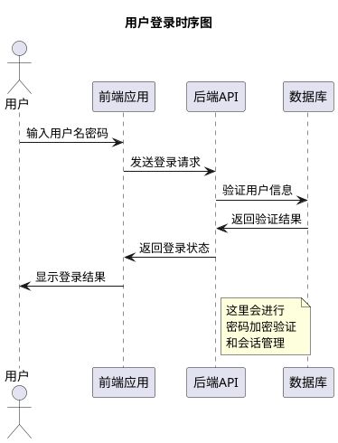
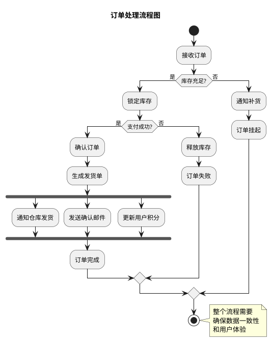
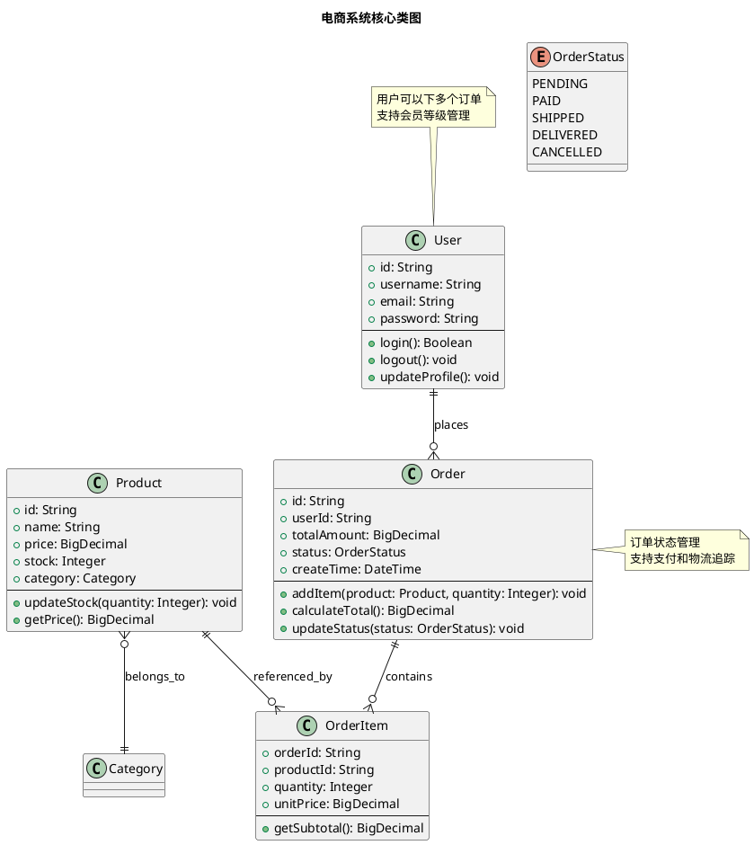

# PlantUML图片质量测试文档

本文档用于测试优化后的PlantUML渲染质量。

## 测试图表1：简单时序图

```plantuml
@startuml
title 用户登录时序图
actor 用户
participant "前端应用" as Frontend
participant "后端API" as Backend  
participant "数据库" as DB

用户 -> Frontend: 输入用户名密码
Frontend -> Backend: 发送登录请求
Backend -> DB: 验证用户信息
DB -> Backend: 返回验证结果
Backend -> Frontend: 返回登录状态
Frontend -> 用户: 显示登录结果

note right of Backend: 这里会进行\n密码加密验证\n和会话管理
@enduml
```

## 测试图表2：复杂活动图

```plantuml
@startuml
title 订单处理流程图

start
:接收订单;

if (库存充足?) then (是)
  :锁定库存;
  if (支付成功?) then (是)
    :确认订单;
    :生成发货单;
    fork
      :通知仓库发货;
    fork again
      :发送确认邮件;
    fork again
      :更新用户积分;
    end fork
    :订单完成;
  else (否)
    :释放库存;
    :订单失败;
  endif
else (否)
  :通知补货;
  :订单挂起;
endif

stop

note right: 整个流程需要\n确保数据一致性\n和用户体验
@enduml
```

## 测试图表3：类图结构

```plantuml
@startuml
title 电商系统核心类图

class User {
  +id: String
  +username: String
  +email: String
  +password: String
  --
  +login(): Boolean
  +logout(): void
  +updateProfile(): void
}

class Product {
  +id: String
  +name: String
  +price: BigDecimal
  +stock: Integer
  +category: Category
  --
  +updateStock(quantity: Integer): void
  +getPrice(): BigDecimal
}

class Order {
  +id: String
  +userId: String
  +totalAmount: BigDecimal
  +status: OrderStatus
  +createTime: DateTime
  --
  +addItem(product: Product, quantity: Integer): void
  +calculateTotal(): BigDecimal
  +updateStatus(status: OrderStatus): void
}

class OrderItem {
  +orderId: String
  +productId: String
  +quantity: Integer
  +unitPrice: BigDecimal
  --
  +getSubtotal(): BigDecimal
}

enum OrderStatus {
  PENDING
  PAID
  SHIPPED
  DELIVERED
  CANCELLED
}

User ||--o{ Order : places
Order ||--o{ OrderItem : contains
Product ||--o{ OrderItem : referenced_by
Product }o--|| Category : belongs_to

note top of User : 用户可以下多个订单\n支持会员等级管理
note right of Order : 订单状态管理\n支持支付和物流追踪
@enduml
```

测试完成后，请检查以上三个图表的清晰度和质量。
