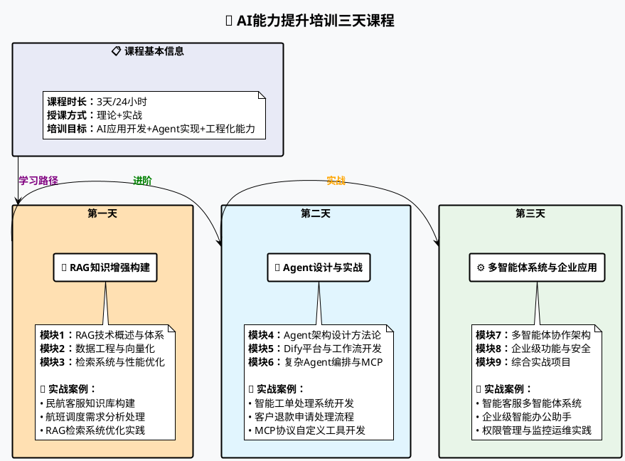
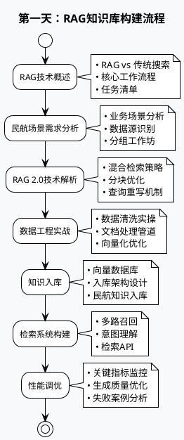
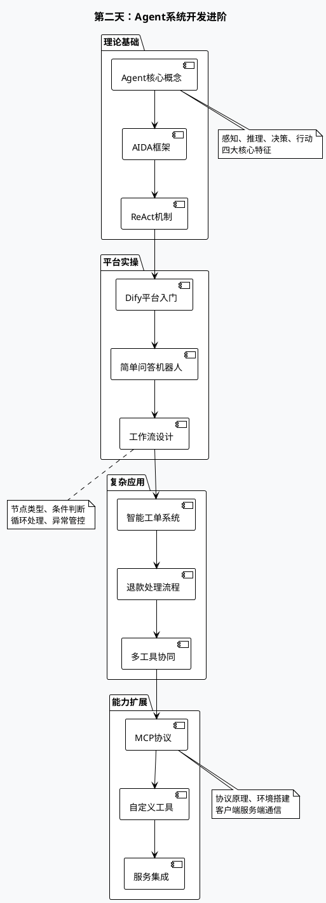
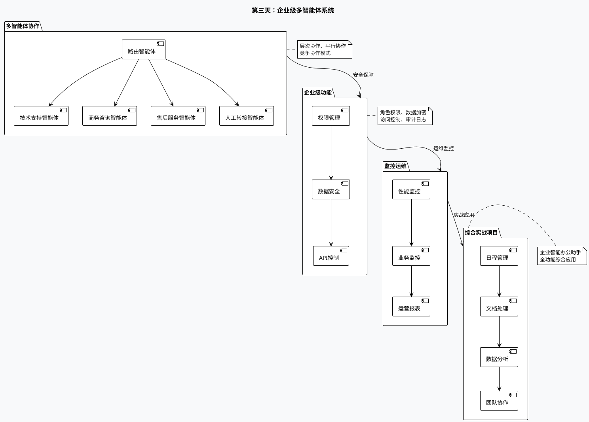
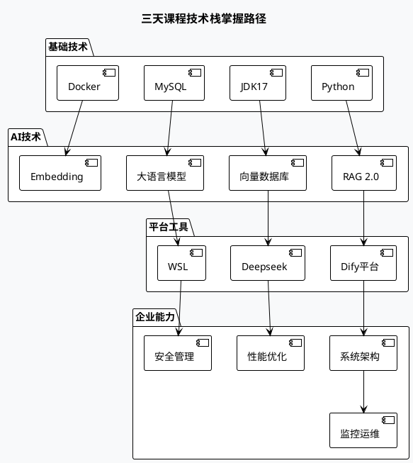

# AI能力提升培训三天课程脉络图

## 课程概述

**课程名称**：AI能力提升培训：RAG知识增强构建、Agent设计与实践，项目案例分享与实战

**课程时长**：3天/24小时

**培训目标**：提升AI应用开发能力以及Agent实现、模型优化部署等方面的工程化能力

## 整体课程架构图

## 详细学习路径

### 第一天：RAG知识库增强构建

**学习主线**：理解RAG知识库构建任务 → 场景化需求分析 → RAG2.0技术实现 → 性能优化 → 问题剖析

#### 🎯 核心模块流程图

### 第二天：Agent系统设计与实践

**学习主线**：智能体概念理解 → Dify平台实操 → 工作流开发 → 复杂编排 → 工具扩展

#### 🤖 智能体开发进阶图

### 第三天：多智能体系统与企业应用

**学习主线**：多智能体协作 → 企业级功能 → 监控运维 → 行业方案 → 综合实战

#### 🏢 企业级应用架构图

## 实战项目成果

### 📊 学习成果矩阵

| 天数            | 核心技能      | 实战项目         | 预期成果                                                     |
| --------------- | ------------- | ---------------- | ------------------------------------------------------------ |
| **第1天** | RAG知识库构建 | 民航客服知识库   | • 完整RAG系统` `• 检索优化技能` `• 性能调优能力 |
| **第2天** | Agent系统开发 | 智能工单处理系统 | • 工作流设计` `• 工具集成` `• MCP协议应用       |
| **第3天** | 多智能体协作  | 企业智能办公助手 | • 多体系统架构` `• 企业级部署` `• 完整解决方案  |

### 🛠️ 技术栈掌握

## 课程特色

### 🎯 教学方法

- **理论结合实践**：每个概念都有对应的实战项目
- **案例驱动学习**：民航行业真实案例贯穿全程
- **分组协作**：工作坊模式促进交流学习
- **渐进式深入**：从基础到高级的完整技能路径

### 📈 能力提升路径

1. **第1天结束**：具备RAG系统构建能力
2. **第2天结束**：掌握智能体开发技能
3. **第3天结束**：拥有企业级AI应用部署能力

### 🏆 预期收获

- ✅ 完整的RAG知识库构建经验
- ✅ 多种智能体开发技能
- ✅ 企业级AI系统设计能力
- ✅ 实际项目落地经验
- ✅ 持续学习和优化的思维

---

*本课程设计注重实战性和实用性，确保学员能够将所学知识直接应用到实际工作中。*
