```plantuml
@startuml
title 订单处理流程图

start
:接收订单;

if (库存充足?) then (是)
  :锁定库存;
  if (支付成功?) then (是)
    :确认订单;
    :生成发货单;
    fork
      :通知仓库发货;
    fork again
      :发送确认邮件;
    fork again
      :更新用户积分;
    end fork
    :订单完成;
  else (否)
    :释放库存;
    :订单失败;
  endif
else (否)
  :通知补货;
  :订单挂起;
endif

stop

note right: 整个流程需要\n确保数据一致性\n和用户体验
@enduml
```

```plantuml
@startuml
title 电商系统核心类图

class User {
  +id: String
  +username: String
  +email: String
  +password: String
  --
  +login(): Boolean
  +logout(): void
  +updateProfile(): void
}

class Product {
  +id: String
  +name: String
  +price: BigDecimal
  +stock: Integer
  +category: Category
  --
  +updateStock(quantity: Integer): void
  +getPrice(): BigDecimal
}

class Order {
  +id: String
  +userId: String
  +totalAmount: BigDecimal
  +status: OrderStatus
  +createTime: DateTime
  --
  +addItem(product: Product, quantity: Integer): void
  +calculateTotal(): BigDecimal
  +updateStatus(status: OrderStatus): void
}

class OrderItem {
  +orderId: String
  +productId: String
  +quantity: Integer
  +unitPrice: BigDecimal
  --
  +getSubtotal(): BigDecimal
}

enum OrderStatus {
  PENDING
  PAID
  SHIPPED
  DELIVERED
  CANCELLED
}

User ||--o{ Order : places
Order ||--o{ OrderItem : contains
Product ||--o{ OrderItem : referenced_by
Product }o--|| Category : belongs_to

note top of User : 用户可以下多个订单\n支持会员等级管理
note right of Order : 订单状态管理\n支持支付和物流追踪
@enduml
```

# PlantUML图片质量测试文档

本文档用于测试优化后的PlantUML渲染质量。

## 测试图表1：简单时序图

```plantuml
<<<<<<< HEAD
@startuml AI培训三天课程脉络
!theme plain
skinparam backgroundColor #F8F9FA
skinparam defaultFontSize 14
skinparam defaultFontName "Microsoft YaHei"
skinparam rectangle {
    BorderThickness 2
    FontStyle bold
}

title <size:20><b>🚀 AI能力提升培训三天课程</b></size>

' 顶部课程基本信息
rectangle "📋 课程基本信息" as info #E8EAF6 {
    note as info_note
        <b>课程时长：</b>3天/24小时
        <b>授课方式：</b>理论+实战
        <b>培训目标：</b>AI应用开发+Agent实现+工程化能力
    end note
}

' 三天课程横向布局
rectangle "第一天" as day1 #FFE0B2 {
    rectangle "🧠 RAG知识增强构建" as d1_title
  
    note bottom of d1_title
        <b>模块1：</b>RAG技术概述与体系
        <b>模块2：</b>数据工程与向量化
        <b>模块3：</b>检索系统与性能优化
      
        <b>🎯 实战案例：</b>
        • 民航客服知识库构建
        • 航班调度需求分析处理
        • RAG检索系统优化实践
    end note
}

rectangle "第二天" as day2 #E1F5FE {
    rectangle "🤖 Agent设计与实战" as d2_title
  
    note bottom of d2_title
        <b>模块4：</b>Agent架构设计方法论
        <b>模块5：</b>Dify平台与工作流开发
        <b>模块6：</b>复杂Agent编排与MCP
      
        <b>🎯 实战案例：</b>
        • 智能工单处理系统开发
        • 客户退款申请处理流程
        • MCP协议自定义工具开发
    end note
}

rectangle "第三天" as day3 #E8F5E8 {
    rectangle "⚙️ 多智能体系统与企业应用" as d3_title
  
    note bottom of d3_title
        <b>模块7：</b>多智能体协作架构
        <b>模块8：</b>企业级功能与安全
        <b>模块9：</b>综合实战项目
      
        <b>🎯 实战案例：</b>
        • 智能客服多智能体系统
        • 企业级智能办公助手
        • 权限管理与监控运维实践
    end note
}

' 连接关系
info -down-> day1 : <color:purple><b>学习路径</b></color>
day1 -right-> day2 : <color:green><b>进阶</b></color>
day2 -right-> day3 : <color:orange><b>实战</b></color>
=======
@startuml
title 用户登录时序图
actor 用户
participant "前端应用" as Frontend
participant "后端API" as Backend  
participant "数据库" as DB

用户 -> Frontend: 输入用户名密码
Frontend -> Backend: 发送登录请求
Backend -> DB: 验证用户信息
DB -> Backend: 返回验证结果
Backend -> Frontend: 返回登录状态
Frontend -> 用户: 显示登录结果
>>>>>>> 2245ff522d05078c5ad72864a9d901ddf56a4ec2

note right of Backend: 这里会进行\n密码加密验证\n和会话管理
@enduml
```

<<<<<<< HEAD
## 详细学习路径

### 第一天：RAG知识库增强构建

**学习主线**：理解RAG知识库构建任务 → 场景化需求分析 → RAG2.0技术实现 → 性能优化 → 问题剖析

#### 🎯 核心模块流程图
=======
## 测试图表2：复杂活动图
>>>>>>> 2245ff522d05078c5ad72864a9d901ddf56a4ec2



<<<<<<< HEAD
### 第二天：Agent系统设计与实践

**学习主线**：智能体概念理解 → Dify平台实操 → 工作流开发 → 复杂编排 → 工具扩展

#### 🤖 智能体开发进阶图
=======
## 测试图表3：类图结构
>>>>>>> 2245ff522d05078c5ad72864a9d901ddf56a4ec2



<<<<<<< HEAD
### 第三天：多智能体系统与企业应用

**学习主线**：多智能体协作 → 企业级功能 → 监控运维 → 行业方案 → 综合实战

#### 🏢 企业级应用架构图

```plantuml
@startuml 第三天企业级应用
!theme plain
skinparam backgroundColor #F8F9FA

title <size:16><b>第三天：企业级多智能体系统</b></size>

package "多智能体协作" as multiagent {
    component [路由智能体] as router
    component [技术支持智能体] as tech
    component [商务咨询智能体] as business
    component [售后服务智能体] as service
    component [人工转接智能体] as human
}

package "企业级功能" as enterprise {
    component [权限管理] as auth
    component [数据安全] as security
    component [API控制] as api
}

package "监控运维" as monitor {
    component [性能监控] as perf
    component [业务监控] as business_monitor
    component [运营报表] as report
}

package "综合实战项目" as project {
    component [日程管理] as schedule
    component [文档处理] as doc
    component [数据分析] as analysis
    component [团队协作] as team
}

router --> tech
router --> business
router --> service
router --> human

auth --> security
security --> api

perf --> business_monitor
business_monitor --> report

schedule --> doc
doc --> analysis
analysis --> team

multiagent --> enterprise : 安全保障
enterprise --> monitor : 运维监控
monitor --> project : 实战应用

note right of multiagent
    层次协作、平行协作
    竞争协作模式
end note

note right of enterprise
    角色权限、数据加密
    访问控制、审计日志
end note

note right of project
    企业智能办公助手
    全功能综合应用
end note

@enduml
```



## 实战项目成果

### 📊 学习成果矩阵

| 天数            | 核心技能      | 实战项目         | 预期成果                                                     |
| --------------- | ------------- | ---------------- | ------------------------------------------------------------ |
| **第1天** | RAG知识库构建 | 民航客服知识库   | • 完整RAG系统`<br>`• 检索优化技能`<br>`• 性能调优能力 |
| **第2天** | Agent系统开发 | 智能工单处理系统 | • 工作流设计`<br>`• 工具集成`<br>`• MCP协议应用       |
| **第3天** | 多智能体协作  | 企业智能办公助手 | • 多体系统架构`<br>`• 企业级部署`<br>`• 完整解决方案  |

### 🛠️ 技术栈掌握

```plantuml
@startuml 技术栈掌握
!theme plain
skinparam backgroundColor #F8F9FA

title <size:16><b>三天课程技术栈掌握路径</b></size>

package "基础技术" {
    [Python] as python
    [JDK17] as java
    [MySQL] as mysql
    [Docker] as docker
}

package "AI技术" {
    [RAG 2.0] as rag
    [向量数据库] as vector
    [大语言模型] as llm
    [Embedding] as embed
}

package "平台工具" {
    [Dify平台] as dify
    [Deepseek] as deepseek
    [WSL] as wsl
}

package "企业能力" {
    [系统架构] as arch
    [性能优化] as perf
    [安全管理] as security
    [监控运维] as ops
}

python --> rag
java --> vector
mysql --> llm
docker --> embed

rag --> dify
vector --> deepseek
llm --> wsl

dify --> arch
deepseek --> perf
wsl --> security
arch --> ops

@enduml
```



## 课程特色

### 🎯 教学方法

- **理论结合实践**：每个概念都有对应的实战项目
- **案例驱动学习**：民航行业真实案例贯穿全程
- **分组协作**：工作坊模式促进交流学习
- **渐进式深入**：从基础到高级的完整技能路径

### 📈 能力提升路径

1. **第1天结束**：具备RAG系统构建能力
2. **第2天结束**：掌握智能体开发技能
3. **第3天结束**：拥有企业级AI应用部署能力

### 🏆 预期收获

- ✅ 完整的RAG知识库构建经验
- ✅ 多种智能体开发技能
- ✅ 企业级AI系统设计能力
- ✅ 实际项目落地经验
- ✅ 持续学习和优化的思维

---

*本课程设计注重实战性和实用性，确保学员能够将所学知识直接应用到实际工作中。*
=======
测试完成后，请检查以上三个图表的清晰度和质量。
>>>>>>> 2245ff522d05078c5ad72864a9d901ddf56a4ec2
