# AI培训课程简明计划

## 📋 课程基本信息

| 项目 | 详情 |
|------|------|
| **课程名称** | AI能力提升培训：RAG知识增强构建、Agent设计与实践 |
| **培训时长** | 4天 × 8小时 = 32小时 |
| **培训方式** | 面授 |
| **培训规模** | 约40人 |
| **培训地点** | 民航凯亚指定地点 |
| **培训时间** | 拟于7-9月（具体时间协商确定） |

## 🗓️ 日程安排

```plantuml
@startuml AI培训课程PPT展示版
!theme plain
skinparam backgroundColor #F8F9FA
skinparam defaultFontSize 11
skinparam rectangle {
    BorderThickness 2
    FontStyle bold
}

title <size:20><b>🎯 AI能力提升培训 - 4天课程体系</b></size>

' 顶部信息栏
rectangle "培训概况" as info #E8EAF6 {
    note as info_content
        <size:12><b>📋 培训基本信息</b></size>
        ━━━━━━━━━━━━━━━━━━━━━━━━━━━━━━━━━━━━━━━━━━━━━━━━━
        <b>🏢 地点：</b>民航凯亚指定地点　　<b>👥 规模：</b>约40人
        <b>⏰ 时长：</b>4天×8小时=32小时　　<b>📅 时间：</b>7-9月（待定）
        <b>🎓 方式：</b>面授 + 实战 + 项目　　<b>🔧 环境：</b>JDK17, MySQL, Docker, Dify
    end note
}

' 课程进阶路径
package "📈 学习进阶路径" as pathway {
    
    ' 第一天
    rectangle "Day 1" as d1 #FFE0B2 {
        rectangle "🧠 RAG知识增强构建" as d1_title #FFF8E1
        rectangle "理论基础" as d1_theory #FFECB3 {
            note as d1_theory_note
                • RAG vs 传统搜索
                • RAG 2.0技术体系
                • 数据工程挑战
            end note
        }
        rectangle "实战演练" as d1_practice #FFE082 {
            note as d1_practice_note
                • 民航文档处理
                • 知识库构建
                • 检索系统优化
            end note
        }
        note bottom of d1
            <b>👨‍🏫 讲师：</b>俞朴勇
            <b>🎯 成果：</b>完整RAG系统
        end note
    }
    
    ' 第二天
    rectangle "Day 2" as d2 #E1F5FE {
        rectangle "🤖 Agent设计与实战" as d2_title #E0F2F1
        rectangle "架构设计" as d2_arch #B2EBF2 {
            note as d2_arch_note
                • Agent核心概念
                • AIDA设计框架
                • Dify平台实操
            end note
        }
        rectangle "工作流开发" as d2_workflow #81D4FA {
            note as d2_workflow_note
                • 智能工单系统
                • 条件判断分支
                • 工具集成开发
            end note
        }
        note bottom of d2
            <b>👨‍🏫 讲师：</b>俞朴勇、支彪
            <b>🎯 成果：</b>智能Agent应用
        end note
    }
    
    ' 第三天
    rectangle "Day 3" as d3 #E8F5E8 {
        rectangle "⚡ Agent设计进阶" as d3_title #C8E6C9
        rectangle "多智能体" as d3_multi #A5D6A7 {
            note as d3_multi_note
                • 协作架构设计
                • 通信机制
                • 智能客服系统
            end note
        }
        rectangle "企业级功能" as d3_enterprise #66BB6A {
            note as d3_enterprise_note
                • 权限管理
                • 安全配置
                • 监控运维
            end note
        }
        note bottom of d3
            <b>👨‍🏫 讲师：</b>俞朴勇、支彪
            <b>🎯 成果：</b>企业级智能助手
        end note
    }
    
    ' 第四天
    rectangle "Day 4" as d4 #F3E5F5 {
        rectangle "🚀 AI+研发智能升级" as d4_title #FCE4EC
        rectangle "工程实践" as d4_engineering #F8BBD9 {
            note as d4_engineering_note
                • 研发流程优化
                • 工程化部署
                • 性能调优
            end note
        }
        rectangle "项目落地" as d4_project #F48FB1 {
            note as d4_project_note
                • 智能研发工具链
                • 项目管理
                • 最佳实践
            end note
        }
        note bottom of d4
            <b>👨‍🏫 讲师：</b>鹿传明
            <b>🎯 成果：</b>完整解决方案
        end note
    }
}

' 底部成果展示
rectangle "🏆 预期收获" as outcomes #E3F2FD {
    note as outcomes_content
        <size:12><b>💪 能力提升矩阵</b></size>
        ━━━━━━━━━━━━━━━━━━━━━━━━━━━━━━━━━━━━━━━━━━━━━━━━━
        <b>📚 RAG技术：</b>🔴无基础 → 🟢独立构建知识库　　<b>🤖 Agent开发：</b>🔴概念模糊 → 🟢完整开发流程
        <b>🔧 工程实践：</b>🟡有基础 → 🟢企业级部署　　　<b>📋 项目经验：</b>🔴缺乏实战 → 🟢完整项目案例
        
        <b>🎁 后续支持：</b>半年内5次现场技术支持（每次4小时+）
    end note
}

' 连接关系
info -down-> pathway
d1 -right-> d2 : <size:12>📈</size>
d2 -right-> d3 : <size:12>⚡</size>
d3 -right-> d4 : <size:12>🚀</size>
pathway -down-> outcomes

@enduml
```



## 📚 课程内容概要

### Day 1️⃣ RAG知识增强构建
> **核心目标**：掌握RAG技术原理与实战应用

- 🎯 **理论基础**：RAG技术概述、工作流程分析
- 🛠️ **实战项目**：民航客服知识库构建
- 📊 **技能获得**：数据处理、向量化、检索优化

### Day 2️⃣ Agent设计与实战
> **核心目标**：学会设计和开发智能Agent

- 🎯 **理论基础**：Agent架构、ReAct框架
- 🛠️ **实战项目**：智能工单处理系统
- 📊 **技能获得**：工作流设计、工具集成

### Day 3️⃣ Agent设计进阶
> **核心目标**：掌握复杂Agent系统开发

- 🎯 **理论基础**：多智能体协作、复杂编排
- 🛠️ **实战项目**：企业级智能助手
- 📊 **技能获得**：系统架构、性能优化

### Day 4️⃣ AI+研发智能升级
> **核心目标**：AI技术在研发流程中的应用

- 🎯 **理论基础**：研发流程优化、工程实践
- 🛠️ **实战项目**：智能研发工具链
- 📊 **技能获得**：工程化部署、项目管理

## 👥 讲师团队

| 讲师 | 负责课程 | 专业领域 |
|------|----------|----------|
| **俞朴勇** | Day1, Day2, Day3 | RAG技术、Agent系统 |
| **支彪** | Day2, Day3 | Agent实战、系统集成 |
| **鹿传明** | Day4 | AI工程化、研发流程 |

## 🎁 后续服务

### 📞 技术支持计划
- **服务期限**：培训结束后半年内
- **支持次数**：5次现场技术支持
- **单次时长**：不少于4小时
- **服务内容**：
  - 🔧 技术问题解答
  - 📋 项目实施指导
  - 💡 最佳实践分享
  - 🚀 性能优化建议

## ⭐ 培训亮点

```plantuml
@startuml 培训特色
!theme plain
skinparam backgroundColor #F8F9FA

mindmap
root)培训特色(
  left side
    (实战导向)
      ::理论结合实践
      ::真实项目案例
      ::动手操作为主
    (专家授课)
      ::资深AI专家
      ::丰富项目经验
      ::前沿技术分享
  right side
    (小班教学)
      ::40人精品班
      ::充分互动交流
      ::个性化指导
    (持续支持)
      ::半年技术咨询
      ::5次现场支持
      ::问题及时解决

@enduml
```

## 🎯 预期成果

| 能力维度 | 培训前 | 培训后 |
|----------|---------|---------|
| **RAG技术** | 🔴 无基础 | 🟢 能独立构建知识库系统 |
| **Agent开发** | 🔴 概念模糊 | 🟢 掌握完整开发流程 |
| **工程实践** | 🟡 有一定基础 | 🟢 具备企业级部署能力 |
| **项目经验** | 🔴 缺乏实战 | 🟢 拥有完整项目案例 |

## 📋 课前准备清单

### 💻 硬件要求
- [x] 笔记本电脑（推荐配置：8GB+内存，i5+处理器）
- [x] 稳定网络连接

### 🛠️ 软件环境
- [x] JDK17
- [x] MySQL数据库
- [x] Docker容器
- [x] WSL (Windows用户)
- [x] Python 3.8+

### 🌐 平台账号
- [x] Deepseek API账号
- [x] Dify平台账号

## 📞 联系方式

**培训咨询**：如有疑问请及时联系相关负责人

**备注**：
- 具体时间安排将根据实际情况进行微调
- 培训材料将在开课前一周发放
- 建议提前完成环境配置

---
<div align="center">
<i>本培训计划最终解释权归主办方所有</i>
</div>
