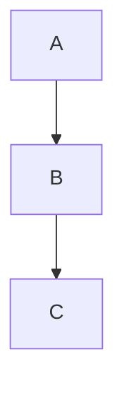

# MD2DOCX - Markdown到Word转换工具

[](https://opensource.org/licenses/MIT)
[](https://www.python.org/downloads/)

专业的Markdown到Word文档转换工具，特别优化技术文档转换需求。

## ⭐ 主要特性

- 🚀 **完整格式支持** - 标题、段落、列表、表格、代码块、链接等
- 💻 **代码友好** - 完美保留代码块换行和格式
- 📊 **图表渲染** - 支持Mermaid、PlantUML图表自动渲染
- 🎨 **专业样式** - 微软雅黑字体、统一排版、美观布局
- ⚡ **智能优化** - 根据内容类型智能处理格式

## 🚀 快速开始

### 安装依赖

```bash
pip install python-docx pillow lxml PyYAML Markdown loguru
```

### 基础使用

```bash
# 推荐：使用优化版本（完美处理代码块换行）
python md2docx_optimized.py input.md -o output.docx

# 标准版本
python md2docx.py input.md -o output.docx
```

## 📋 版本对比

| 功能 | 标准版本 | 优化版本 ⭐ |
|------|----------|------------|
| 基础转换 | ✅ | ✅ |
| 图表渲染 | ✅ | ✅ |
| 表格处理 | ✅ | ✅ |
| 代码块换行 | ❌ | ✅ |
| 命令行格式 | ❌ | ✅ |

**推荐使用优化版本**，特别是处理技术文档时。

## 📖 支持的格式

### 基础语法
- 标题 (`# ## ###`)
- 粗体斜体 (`**bold** *italic*`)
- 代码 (`` `code` ``)
- 链接 (`[text](url)`)

### 代码块
````markdown
```python
def hello():
    print("Hello, World!")
```
````

### 表格
```markdown
| 列1 | 列2 | 列3 |
|-----|:---:|----:|
| 左 | 中 | 右 |
```

### 图表
````markdown

````

## 📁 项目结构

```
md2docx/
├── md2docx.py                    # 标准版本
├── md2docx_optimized.py          # 优化版本 ⭐
├── docs/
│   └── MD2DOCX使用指南.md         # 完整文档
└── src/
    └── md2doc/
        ├── core/                 # 核心转换模块
        ├── engines/              # 图表渲染引擎
        └── utils/                # 工具函数
```

## 🎯 使用场景

- **技术文档** - API文档、开发指南
- **培训材料** - 课程文档、操作手册  
- **项目报告** - 进度汇总、技术分析

## 📚 完整文档

详细使用指南请参考：[MD2DOCX使用指南](docs/MD2DOCX使用指南.md)

## 🐛 常见问题

**Q: 代码块换行显示不正确？**
A: 使用优化版本 `md2docx_optimized.py`

**Q: 图表显示为代码？**
A: 确保安装图表渲染依赖

## 📄 许可证

MIT License - 详见 [LICENSE](LICENSE) 文件

## 🚀 快速体验

```bash
# 创建测试文件
echo "# 测试文档

## 代码示例
\`\`\`python
print('Hello, MD2DOCX!')
\`\`\`" > test.md

# 转换为Word
python md2docx_optimized.py test.md

# 查看生成的 test.docx 文件
```

---

⭐ **推荐使用优化版本获得最佳体验！**
