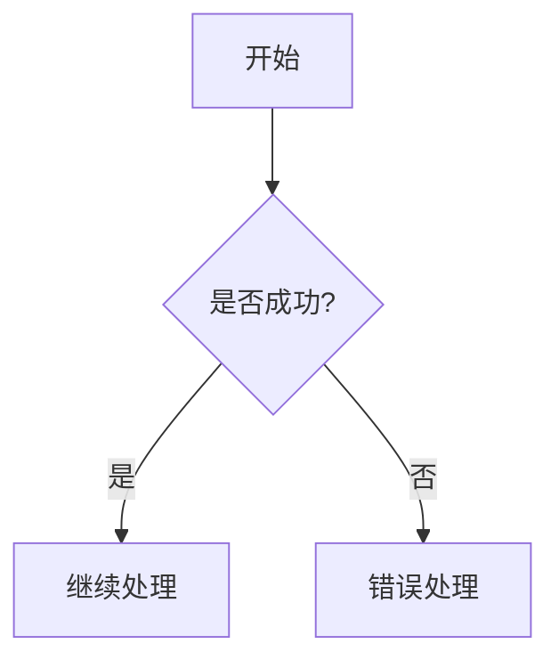

# MD2DOC 功能验证测试文档

这是一个综合性的测试文档，用于验证MD2DocConverter的所有转换功能。

## 1. 基本文本格式

### 1.1 字体样式
- **粗体文本** - 重要内容强调
- *斜体文本* - 一般强调
- `行内代码` - 代码片段

### 1.2 段落测试
这是第一个段落。包含普通文本内容，用于测试基本的段落渲染。

这是第二个段落，测试段落间距。

## 2. 标题层级测试

### 2.1 三级标题
#### 2.1.1 四级标题
##### 2.1.1.1 五级标题
###### 2.1.1.1.1 六级标题

## 3. 列表功能

### 3.1 无序列表
- 第一级项目
  - 第二级项目
    - 第三级项目
- 另一个第一级项目
- 最后一个项目

### 3.2 有序列表
1. 第一项
   1. 子项目1
   2. 子项目2
2. 第二项
3. 第三项

## 4. 代码块测试

```python
def hello_world():
    print("Hello, MD2DOC!")
    return "完成"

result = hello_world()
```

```javascript
function calculateSum(a, b) {
    return a + b;
}

const result = calculateSum(10, 20);
console.log(result);
```

## 5. 表格功能

### 5.1 基本表格
| 功能 | 状态 | 备注 |
|------|------|------|
| 文本解析 | 完成 | 支持所有基本格式 |
| 表格转换 | 完成 | 支持复杂表格 |
| 代码块 | 完成 | 支持语法高亮 |

### 5.2 对齐表格
| 左对齐 | 居中 | 右对齐 |
|:-------|:----:|-------:|
| 数据1 | 数据2 | 数据3 |
| 长文本数据 | 短文本 | 999 |

## 6. 链接测试

- [文本链接](https://www.example.com)
- [带标题的链接](https://www.example.com "这是链接标题")

## 7. 图表代码块占位符



## 8. 转换统计信息

本文档包含了MD2DOC支持的主要Markdown元素：
- 标题 (1-6级)
- 段落和文本格式
- 列表 (有序/无序/嵌套)
- 代码块 (带语法标识)
- 表格 (基本/对齐)
- 链接

---

**测试完成** - MD2DOC v1.0.0
