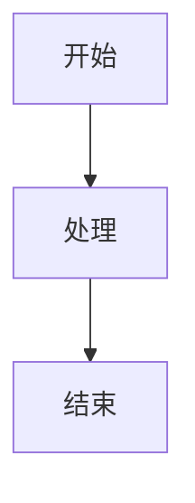
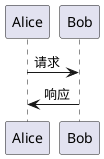
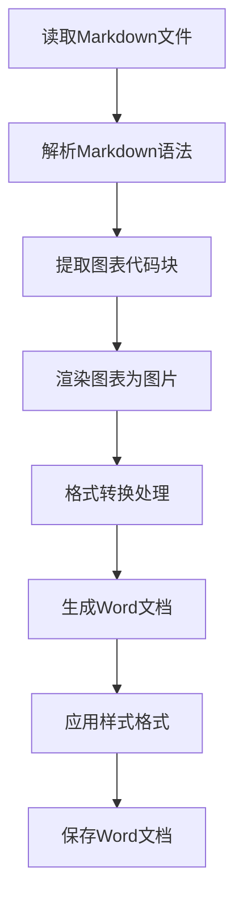

# MD2DOCX 工具完整使用指南

## 📋 项目概述

**MD2DOCX** 是一个专业的Markdown到Word文档转换工具，提供高质量的格式转换和丰富的功能支持。该工具专门针对技术文档的转换需求进行优化，特别是代码块、表格、图表等元素的处理。

### 🎯 核心特性

- 🚀 **完整格式支持**：标题、段落、列表、表格、代码块、链接等
- 📊 **图表渲染**：支持Mermaid、PlantUML图表自动渲染
- 🎨 **专业样式**：微软雅黑字体、统一排版、美观布局
- 💻 **代码友好**：完美保留代码块换行和格式
- 📱 **批量处理**：支持单文件和批量转换模式
- 🔧 **智能优化**：根据内容类型智能处理格式

---

## 🚀 快速开始

### 环境要求

- Python 3.8+
- 已安装依赖包：`python-docx`、`pillow`、`lxml`等

### 安装依赖

```bash
# 创建虚拟环境
python -m venv venv
source venv/bin/activate  # Windows: venv\Scripts\activate

# 安装依赖
pip install python-docx pillow lxml PyYAML Markdown loguru
```

### 基础使用

```bash
# 基本转换
python md2docx.py input.md

# 指定输出文件
python md2docx.py input.md -o output.docx

# 使用优化版本（推荐）
python md2docx_optimized.py input.md -o output.docx

# 显示详细信息
python md2docx.py input.md -v
```

---

## 📖 功能详解

### 1. 标准版本 (md2docx.py)

**适用场景**：一般文档转换需求

**特性**：
- ✅ 完整的Markdown语法支持
- ✅ 专业的Word文档样式
- ✅ 图表渲染能力
- ✅ 表格格式优化
- ❌ 代码块换行可能有问题

**使用示例**：
```bash
python md2docx.py "技术文档.md" -o "技术文档.docx"
```

### 2. 优化版本 (md2docx_optimized.py) ⭐推荐⭐

**适用场景**：包含大量代码块的技术文档

**特性**：
- ✅ 所有标准版本功能
- ✅ **代码块换行完美保留**
- ✅ **命令行格式正确显示**
- ✅ 智能文本清理策略
- ✅ 内容类型识别优化

**使用示例**：
```bash
python md2docx_optimized.py "API文档.md" -o "API文档.docx"
```

### 3. 支持的Markdown元素

#### 文本格式
```markdown
# 一级标题
## 二级标题
### 三级标题

**粗体文本**
*斜体文本*
`内联代码`
[链接文本](https://example.com)
```

#### 列表
```markdown
- 无序列表项1
- 无序列表项2
  - 嵌套项1
  - 嵌套项2

1. 有序列表项1
2. 有序列表项2
```

#### 代码块
````markdown
```python
def hello_world():
    print("Hello, World!")
    return True
```

```bash
ssh -T git@github.com
ssh-keygen -t ed25519 -C "email@example.com"
```
````

#### 表格
```markdown
| 列1 | 列2 | 列3 |
|-----|:---:|----:|
| 左对齐 | 居中 | 右对齐 |
| 数据1 | 数据2 | 数据3 |
```

#### 引用块
```markdown
> 这是一个引用块
> 可以包含多行内容
```

---

## 🔧 高级功能

### 图表支持

#### Mermaid图表
````markdown

````

#### PlantUML图表
````markdown

````

### 批量转换

```bash
# 转换目录中所有.md文件
python batch_convert.py input_directory/ output_directory/
```

### 样式定制

工具默认使用专业的Word样式：
- **字体**：微软雅黑（正文）+ Consolas（代码）
- **标题**：层级化样式，字号递减
- **代码块**：灰色背景，等宽字体
- **表格**：网格样式，表头加粗

---

## 🎯 版本对比

| 功能 | 标准版本 | 优化版本 |
|------|----------|----------|
| 基础Markdown转换 | ✅ | ✅ |
| 图表渲染 | ✅ | ✅ |
| 表格处理 | ✅ | ✅ |
| 代码块换行保留 | ❌ | ✅ |
| 命令行格式优化 | ❌ | ✅ |
| 智能文本清理 | ❌ | ✅ |
| 内容类型识别 | ❌ | ✅ |

**推荐使用**：优化版本 (`md2docx_optimized.py`)

---

## 🛠️ 技术架构

### 核心模块

```
md2docx/
├── md2docx.py                    # 标准版本入口
├── md2docx_optimized.py          # 优化版本入口
└── src/
    └── md2doc/
        ├── core/
        │   ├── format_converter.py          # 标准格式转换器
        │   ├── format_converter_optimized.py # 优化格式转换器
        │   ├── parser.py                    # Markdown解析器
        │   └── generator.py                 # Word文档生成器
        ├── engines/
        │   ├── mermaid_engine.py           # Mermaid渲染引擎
        │   └── plantuml_engine.py          # PlantUML渲染引擎
        └── utils/
            ├── text_cleaner.py             # 文本清理工具
            └── style_manager.py            # 样式管理器
```

### 转换流程



---

## 📋 使用场景

### 1. 技术文档转换
- **API文档**：接口说明、代码示例
- **开发指南**：安装步骤、配置说明
- **架构设计**：系统图表、流程说明

### 2. 培训材料制作
- **课程文档**：教学内容、实践案例
- **操作手册**：步骤说明、命令示例
- **知识库**：技术积累、经验总结

### 3. 报告生成
- **项目报告**：进度汇总、技术分析
- **研究文档**：实验结果、数据分析
- **方案设计**：技术选型、实施计划

---

## 🐛 故障排除

### 常见问题

#### 1. 代码块换行显示不正确
**问题**：代码块中的换行符被替换为空格
**解决**：使用优化版本 `md2docx_optimized.py`

```bash
# 错误用法
python md2docx.py code_doc.md

# 正确用法
python md2docx_optimized.py code_doc.md
```

#### 2. 中文字体显示问题
**问题**：生成的Word文档中文字体不是微软雅黑
**解决**：工具会自动设置微软雅黑字体，如仍有问题可检查系统字体

#### 3. 图表不显示
**问题**：Mermaid或PlantUML图表显示为代码
**解决**：确保已安装图表渲染依赖

```bash
# 安装图表渲染依赖
pip install mermaid-cli plantuml
```

#### 4. 文件编码问题
**问题**：读取Markdown文件时出现编码错误
**解决**：确保Markdown文件使用UTF-8编码保存

### 错误代码说明

| 错误码 | 说明 | 解决方案 |
|--------|------|----------|
| E001 | 文件不存在 | 检查输入文件路径 |
| E002 | 不支持的文件格式 | 确保输入文件为.md或.markdown |
| E003 | 权限不足 | 检查输出目录写入权限 |
| E004 | 依赖库缺失 | 安装所需依赖包 |

---

## 📈 性能优化

### 转换速度
- **小文件**（<100KB）：通常1-2秒完成
- **中等文件**（100KB-1MB）：通常5-10秒完成
- **大文件**（>1MB）：可能需要30秒以上

### 内存使用
- **标准转换**：通常占用50-100MB内存
- **图表渲染**：可能增加100-200MB内存使用
- **批量转换**：建议分批处理大量文件

### 优化建议
1. **使用SSD**：提高文件读写速度
2. **关闭杀毒软件**：避免实时扫描影响
3. **分批处理**：大量文件建议分批转换

---

## 🔄 更新日志

### v1.1.0 (2025-08-17)
- ✨ 新增优化版本转换器
- 🐛 修复代码块换行显示问题
- 🎨 改进命令行格式显示
- ⚡ 优化文本清理策略

### v1.0.0 (2025-08-01)
- 🎉 首次发布
- ✨ 基础Markdown转换功能
- 📊 图表渲染支持
- 🎨 专业Word样式

---

## 📞 技术支持

### 开发团队
- **项目维护**：MD2DOC开发团队
- **技术架构**：AI文档处理系统
- **更新频率**：持续迭代优化

### 联系方式
- **代码仓库**：GitHub Repository
- **问题反馈**：通过Issues提交
- **功能建议**：欢迎PR贡献

---

## 📄 许可证

本项目采用 MIT 许可证，详见 [LICENSE](LICENSE) 文件。

---

## 🎉 总结

MD2DOCX 是一个功能强大、易于使用的Markdown到Word转换工具。无论是技术文档编写、培训材料制作，还是报告生成，都能提供专业的转换效果。

**推荐使用优化版本**，特别是处理包含代码块的技术文档时，能够完美保留格式和换行结构。

开始使用：
```bash
python md2docx_optimized.py your_document.md -o your_document.docx
```

享受高效的文档转换体验！🚀
