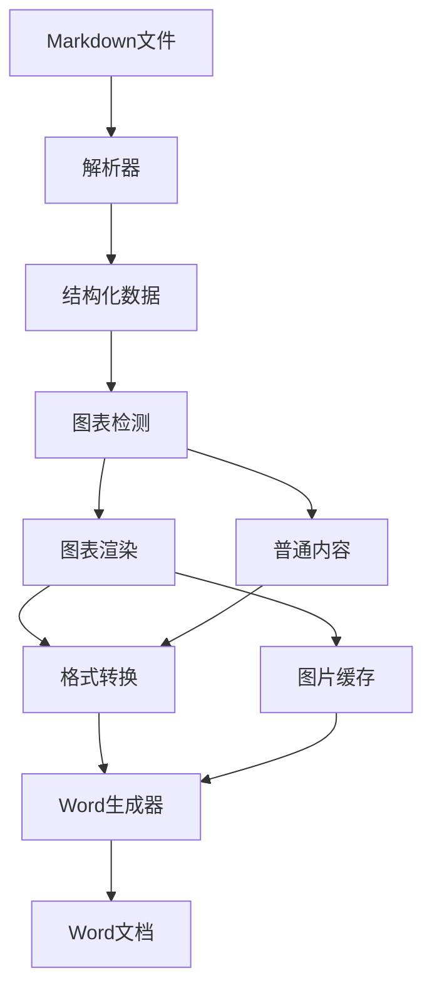

# MD2DOC 工具产品需求文档 (PRD)

---

**项目名称：** MD2DOC - Markdown到Word文档转换工具  
**版本：** V1.0  
**创建日期：** 2025年8月1日  
**负责人：** 开发团队  

---

## 1. 产品概述

### 1.1 产品定位
MD2DOC是一个专业的Markdown到Word文档转换工具，专注于解决现有转换工具的两大核心问题：
1. **图表代码直接显示**：自动渲染Mermaid、PlantUML等图表为图片
2. **格式乱码问题**：完美映射Markdown格式到Word样式

### 1.2 目标用户
- **技术文档编写者**：需要将技术文档转换为商务可读的Word格式
- **项目经理**：需要将开发文档转换为客户交付物
- **咨询顾问**：需要将分析报告转换为正式提案
- **企业团队**：需要标准化文档输出格式

### 1.3 核心价值
- **专业转换**：支持复杂格式的准确转换
- **图表渲染**：自动处理技术图表，生成高质量图像
- **样式一致**：保持企业级文档的专业外观
- **高效批处理**：支持多文件批量转换

## 2. 功能需求

### 2.1 核心功能模块

#### 2.1.1 Markdown解析引擎
**功能描述：** 高精度解析Markdown文档结构和格式
**优先级：** P0

**功能清单：**
- [x] 基础Markdown语法解析（标题、段落、列表）
- [ ] 增强格式解析（粗体、斜体、代码、链接）
- [ ] 表格结构解析（支持复杂表格）
- [ ] 代码块识别和分类
- [ ] 嵌套结构处理（列表嵌套、引用嵌套）

**技术要求：**
- 支持GitHub Flavored Markdown (GFM)
- 容错处理，支持不规范的Markdown语法
- 保持原文档的逻辑结构

#### 2.1.2 图表渲染引擎
**功能描述：** 将代码形式的图表转换为高质量图片
**优先级：** P0

**支持的图表类型：**
- **Mermaid图表**：流程图、时序图、甘特图、类图等
- **PlantUML图表**：UML类图、时序图、用例图等
- **代码块图表**：简单的ASCII图表

**渲染方案：**
```
优先级1：本地渲染（mermaid-cli + puppeteer）
优先级2：在线API渲染（mermaid.ink、plantuml.com）
优先级3：文字描述替代
```

**技术要求：**
- 图片质量：300DPI，适合打印
- 尺寸适配：自动调整适合Word页面宽度
- 错误处理：渲染失败时提供降级方案
- 缓存机制：避免重复渲染相同图表

#### 2.1.3 格式转换引擎
**功能描述：** 精确映射Markdown格式到Word样式
**优先级：** P0

**格式映射表：**
| Markdown格式 | Word样式 | 示例 |
|-------------|----------|------|
| `# 标题` | Heading 1 | 一级标题 |
| `## 标题` | Heading 2 | 二级标题 |
| `**粗体**` | Bold | **重要内容** |
| `*斜体*` | Italic | *强调内容* |
| `` `代码` `` | Code Span | `函数名` |
| `[链接](url)` | Hyperlink | [访问链接](http://example.com) |
| `<br/>` | Line Break | 换行 |
| `> 引用` | Quote Style | 引用段落 |
| `- 列表` | Bullet List | 无序列表 |
| `1. 列表` | Number List | 有序列表 |

**高级格式处理：**
- 嵌套格式：`**粗体*斜体***`
- 表格格式：列宽自适应、表头样式
- 代码块：语法高亮（可选）
- 数学公式：LaTeX转换（扩展功能）

#### 2.1.4 Word文档生成器
**功能描述：** 生成符合企业标准的Word文档
**优先级：** P0

**文档结构：**
- 文档属性：标题、作者、创建时间等
- 样式系统：统一的标题、段落、表格样式
- 页面设置：页边距、页眉页脚、页码
- 目录生成：自动生成基于标题的目录

**样式模板：**
```
企业标准模板：
- 字体：中文宋体，英文Times New Roman
- 标题：多级标题样式，自动编号
- 段落：首行缩进、行间距1.5倍
- 表格：三线表格式，表头加粗
- 图片：居中对齐，自动编号
```

### 2.2 扩展功能

#### 2.2.1 批量转换功能
**功能描述：** 支持多文件批量处理
**优先级：** P1

**功能特性：**
- 文件夹批量扫描
- 转换进度显示
- 错误日志记录
- 输出文件命名规则

#### 2.2.2 模板系统
**功能描述：** 支持自定义Word文档模板
**优先级：** P1

**模板类型：**
- 技术文档模板
- 商务提案模板
- 项目报告模板
- 自定义企业模板

#### 2.2.3 配置管理
**功能描述：** 灵活的转换配置选项
**优先级：** P2

**配置项：**
- 图表渲染设置（尺寸、质量、渲染器选择）
- 格式转换设置（样式映射、字体设置）
- 输出设置（文件命名、路径、压缩）

## 3. 技术架构

### 3.1 模块架构
```
md2doc/
├── core/                    # 核心引擎
│   ├── parser.py           # Markdown解析器
│   ├── renderer.py         # 图表渲染器
│   ├── converter.py        # 格式转换器
│   └── generator.py        # Word生成器
├── engines/                # 渲染引擎
│   ├── mermaid_engine.py   # Mermaid渲染
│   ├── plantuml_engine.py  # PlantUML渲染
│   └── base_engine.py      # 基础引擎接口
├── templates/              # 文档模板
│   ├── standard.py         # 标准模板
│   ├── business.py         # 商务模板
│   └── technical.py        # 技术模板
├── utils/                  # 工具模块
│   ├── file_handler.py     # 文件处理
│   ├── image_processor.py  # 图片处理
│   └── config_manager.py   # 配置管理
└── cli/                    # 命令行接口
    ├── main.py            # 主入口
    └── commands.py        # 命令处理
```

### 3.2 数据流设计


### 3.3 技术选型

#### 核心依赖
- **python-docx**：Word文档操作
- **markdown**：Markdown解析基础
- **beautifulsoup4**：HTML解析辅助
- **Pillow**：图片处理
- **requests**：网络请求

#### 图表渲染
- **mermaid-cli**：本地Mermaid渲染
- **plantuml**：PlantUML渲染
- **selenium/puppeteer**：浏览器自动化

#### 扩展工具
- **click**：命令行界面
- **PyYAML**：配置文件解析
- **jinja2**：模板引擎

## 4. 用户体验设计

### 4.1 命令行界面
```bash
# 基础转换
md2doc input.md -o output.docx

# 批量转换
md2doc docs/ -o output/ --batch

# 指定模板
md2doc input.md -t business --output report.docx

# 配置选项
md2doc input.md --chart-engine mermaid-cli --dpi 300
```

### 4.2 Python API
```python
from md2doc import MD2DocConverter

# 简单使用
converter = MD2DocConverter()
converter.convert('input.md', 'output.docx')

# 高级配置
converter = MD2DocConverter(
    template='business',
    chart_engine='mermaid-cli',
    dpi=300
)
result = converter.convert_with_options('input.md', 'output.docx')
```

### 4.3 错误处理和日志
```
转换过程日志：
[INFO] 开始解析 input.md
[INFO] 检测到 3 个Mermaid图表
[INFO] 渲染图表 1/3: 流程图
[WARNING] 图表 2/3 渲染失败，使用文字描述
[INFO] 应用格式转换
[INFO] 生成Word文档: output.docx
[SUCCESS] 转换完成，耗时 15.2s
```

## 5. 性能指标

### 5.1 转换速度
- **小文档**（<100KB）：< 5秒
- **中文档**（100KB-1MB）：< 30秒
- **大文档**（>1MB）：< 2分钟

### 5.2 图表渲染
- **Mermaid图表**：平均 2-5秒/图
- **PlantUML图表**：平均 3-8秒/图
- **缓存命中率**：> 80%

### 5.3 格式准确率
- **基础格式**：> 99%
- **复杂嵌套**：> 95%
- **表格结构**：> 98%

## 6. 质量标准

### 6.1 代码质量
- **测试覆盖率**：> 90%
- **代码规范**：PEP 8
- **类型注解**：100%覆盖
- **文档覆盖**：所有公共API

### 6.2 文档质量
- **API文档**：完整的接口说明
- **用户手册**：详细使用指南
- **示例代码**：覆盖主要使用场景
- **FAQ文档**：常见问题解答

### 6.3 兼容性
- **Python版本**：3.8+
- **操作系统**：Windows、macOS、Linux
- **Word版本**：2010+
- **Markdown规范**：CommonMark + GFM

## 7. 项目里程碑

### 阶段1：基础框架（2周）
- [x] 项目结构搭建
- [ ] 基础Markdown解析
- [ ] 简单Word生成
- [ ] 单元测试框架

### 阶段2：图表渲染（2周）
- [ ] Mermaid渲染引擎
- [ ] PlantUML渲染引擎
- [ ] 图片处理和缓存
- [ ] 错误处理和降级

### 阶段3：格式转换（1周）
- [ ] 完整格式映射表
- [ ] 嵌套格式处理
- [ ] 表格转换优化
- [ ] 样式模板系统

### 阶段4：用户界面（1周）
- [ ] 命令行界面
- [ ] 批量处理功能
- [ ] 配置管理系统
- [ ] 错误日志和进度显示

### 阶段5：测试和优化（1周）
- [ ] 完整测试用例
- [ ] 性能优化
- [ ] 文档编写
- [ ] 发布准备

## 8. 风险评估

### 8.1 技术风险
| 风险项 | 风险等级 | 影响 | 应对策略 |
|--------|----------|------|----------|
| 图表渲染失败 | 中 | 功能缺失 | 多重降级方案 |
| 格式转换错误 | 低 | 显示问题 | 完善测试用例 |
| 性能瓶颈 | 中 | 用户体验 | 缓存和并行处理 |
| 依赖库冲突 | 低 | 安装问题 | 虚拟环境隔离 |

### 8.2 业务风险
| 风险项 | 风险等级 | 影响 | 应对策略 |
|--------|----------|------|----------|
| 用户需求变更 | 低 | 开发延期 | 模块化设计 |
| 竞品出现 | 中 | 市场份额 | 专注特色功能 |

## 9. 成功标准

### 9.1 功能完整性
- ✅ 所有P0功能100%实现
- ✅ 图表渲染成功率>95%
- ✅ 格式转换准确率>99%

### 9.2 用户满意度
- ✅ 转换速度满足性能指标
- ✅ 输出文档质量达到商用标准
- ✅ 错误处理友好，有明确提示

### 9.3 可维护性
- ✅ 代码结构清晰，易于扩展
- ✅ 文档完善，便于后续维护
- ✅ 测试覆盖全面，回归测试完整

---

**附录：**
- [技术调研报告](./tech-research.md)
- [竞品分析报告](./competitor-analysis.md)
- [用户调研结果](./user-research.md)
