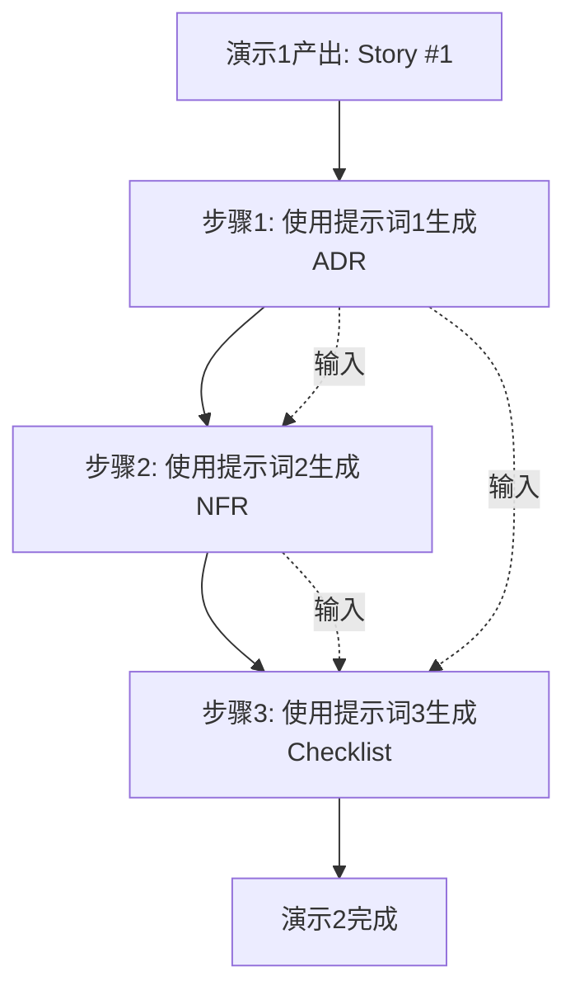

# 演示2：从Story到设计工件 - 完整提示词

## 📋 准备工作：提示词输入材料

### 输入材料清单

在执行以下三个步骤的提示词之前，需要准备：

1. **Story #1完整内容** （来自演示1输出）
2. **技术上下文** （可选，如公司技术栈、现有系统架构）
3. **合规要求** （可选，如等保三级、行业特定标准）

---

## 🎯 步骤1：生成ADR草案

### 提示词1.1：基础版（适合快速演示）

```
# 角色定义
你是一位资深软件架构师，擅长编写架构决策记录（ADR，Architecture Decision Record）。

# 任务
基于以下User Story，生成一份完整的ADR文档，记录关键技术选型决策。

# 输入材料
{这里粘贴Story #1的完整内容}

# 输出要求

## 1. ADR结构（必须包含以下8个章节）

### 第1章：元信息
- ADR编号：ADR-001
- 状态：提议中/已接受/已废弃
- 决策日期：YYYY-MM-DD
- 决策人：架构组
- 关联Story：Story #1

### 第2章：背景（Context）
从Story中提取：
- 业务需求（功能性需求的核心）
- 技术约束（Story中的"技术考量"和"安全标准"）
- 当前痛点（Story背景中描述的问题）
- 性能要求（Story中的性能标准）
- 合规要求（Story中的合规性标准）

### 第3章：决策（Decision）
- 明确说明采用什么技术方案
- 技术方案的核心能力（3-5条）
- 部署模式（如私有化部署/公有云/混合云）

### 第4章：权衡分析（Consequences）
使用表格形式展示：
- ✅ 优势（至少5条，关联Story中的需求）
- ⚠️ 劣势与风险（至少5条，每条配套缓解措施）

### 第5章：备选方案（Alternatives Considered）
- 至少列出1个备选方案
- 说明"为什么不选"（3-5条理由）
- 说明备选方案的适用场景

### 第6章：回滚条件（Rollback Trigger）**【重点】**
使用表格格式，包含：
- 触发条件（什么情况下回滚？）
- 判定标准（如何量化判断？）
- 责任人（谁来决策？）
- 回滚时间窗口（多久内完成？）

还需要包含：
- 回滚执行计划（5步流程）
- 回滚验证方法

### 第7章：实施计划（Implementation）
分3个阶段：
- 阶段1：采购与部署（时间/任务清单）
- 阶段2：定制与训练（时间/任务清单）
- 阶段3：联调与验证（时间/任务清单）

### 第8章：监控与评估（Monitoring）
包含：
- 关键指标表格（指标/目标值/监控方式/告警阈值）
- 定期评审机制（月度/季度/年度）

## 2. 写作要求

### 可追溯性
- 每个决策点必须关联Story中的具体约束条件
- 使用"← 来自Story的XXX标准"标注来源

### 量化表达
- 避免"性能好""很安全"等模糊表达
- 使用具体数字：准确率≥95%、延迟P95<3秒

### 风险意识
- 权衡分析中的每个劣势，必须配套缓解措施
- 回滚条件必须具体可判定（不能是"效果不好"这种主观描述）

### 专业术语
- 使用行业标准术语（如P95/P99、RTO/RPO、MTBF/MTTR）
- 首次出现时提供简短解释

## 3. 特别强调

### 回滚条件设计原则（这是今天演示的核心亮点）
- 必须量化（不能是"效果不理想"）
- 必须有触发机制（谁来监控？多久判定一次？）
- 必须有备选方案（回滚到哪里？）
- 必须有执行计划（具体步骤、预计时间）

### 格式规范
- 使用Markdown格式
- 表格用于结构化信息展示
- 使用emoji增强可读性（✅ ⚠️ ❌ 📋 🔧）

# 输出格式
直接输出完整的ADR文档，不要有任何前言或解释。
```

---

### 提示词1.2：增强版（适合实际项目使用）

```
# 角色定义
你是一位资深软件架构师，拥有15年大型系统架构经验，擅长：
- 技术选型决策与风险评估
- 架构决策记录（ADR）编写
- 供应商评估与合同谈判
- 容灾与回滚方案设计

# 任务
基于以下User Story和技术上下文，生成一份完整的ADR文档。

# 输入材料

## Story内容
{这里粘贴Story #1的完整内容}

## 技术上下文（可选）
{这里粘贴公司现有技术栈、架构约束、团队能力等信息}

## 合规要求（可选）
{这里粘贴特定合规标准，如等保三级、GDPR等}

# 输出要求

## ADR结构（10个章节，增强版）

### 第1章：元信息
- ADR编号：ADR-001
- 标题：{从Story中提取的核心技术选型主题}
- 状态：提议中
- 决策日期：{当前日期}
- 决策人：架构组
- 参与人：{根据Story推断，如安全组、运维组}
- 关联Story：Story #1（链接）
- 关联文档：{列出会涉及的其他文档}

### 第2章：背景（Context）

#### 2.1 业务需求
- 从Story的业务价值和验收标准中提取
- 按优先级排序（P0/P1/P2）

#### 2.2 技术约束
- 从Story的"技术考量"中提取
- 补充Story中隐含的约束（如内网部署→无法使用公有云服务）

#### 2.3 当前痛点
- 从Story背景中提取现状问题
- 量化痛点（如"人工记录效率低→每次审讯需额外30分钟"）

#### 2.4 非功能性需求
- 性能：从Story性能标准中提取
- 安全：从Story安全标准中提取
- 合规：从Story合规标准中提取

### 第3章：决策（Decision）

#### 3.1 核心决策
明确说明：采用{具体技术方案}

#### 3.2 技术方案概述
- 架构模式：{如微服务/单体/事件驱动}
- 部署模式：{如私有化部署/公有云/边缘计算}
- 核心技术栈：{列出关键技术组件}

#### 3.3 核心能力
- 列出5-7条该方案的核心能力
- 每条关联Story中的具体需求

### 第4章：技术调研（Research）**【新增章节】**

#### 4.1 候选方案清单
列出3个候选方案：
- 方案A：{推荐方案}
- 方案B：{备选方案}
- 方案C：{另一备选}

#### 4.2 评估维度
使用评分矩阵（1-5分）：
| 方案 | 功能完整性 | 性能 | 成本 | 风险 | 技术成熟度 | 团队能力匹配 | 总分 |
|------|-----------|------|------|------|-----------|-------------|------|

#### 4.3 选型理由
为什么方案A得分最高？（3-5条关键理由）

### 第5章：权衡分析（Consequences）

#### 5.1 优势分析
使用表格：
| 维度 | 具体优势 | 证据/案例 |
|------|----------|-----------|

至少包含以下维度：
- 功能匹配度
- 性能指标
- 安全合规
- 成本效益
- 技术支持
- 团队能力

#### 5.2 劣势与风险
使用表格：
| 维度 | 具体劣势/风险 | 影响程度 | 缓解措施 | 责任人 |
|------|--------------|----------|----------|--------|

至少包含：
- 成本风险
- 采购/交付周期风险
- 供应商锁定风险
- 技术债务
- 运维复杂度

### 第6章：备选方案（Alternatives Considered）

对于每个备选方案，说明：
- 方案概述
- 优势（3-5条）
- 劣势（3-5条）
- 为什么不选（决定性因素）
- 适用场景（什么情况下应该选这个方案）

### 第7章：回滚条件（Rollback Trigger）**【核心章节】**

#### 7.1 回滚触发条件表
| 触发条件 | 判定标准 | 监控方式 | 判定周期 | 责任人 | 回滚时间窗口 |
|----------|----------|----------|----------|--------|-------------|

至少包含以下场景：
- 性能不达标
- 成本超预算
- 安全漏洞
- 供应商交付延期
- 技术债务不可控

#### 7.2 回滚决策机制
- 谁有权决策回滚？（如技术委员会投票）
- 决策流程（提议→评估→投票→执行）
- 紧急回滚流程（如发现安全漏洞）

#### 7.3 回滚执行计划
详细步骤：
1. 停止使用当前方案（影响范围/停机时间）
2. 准备备选方案环境（预计时间）
3. 数据迁移（工具/流程/验证）
4. 切换验证（小范围试点→全量）
5. 清理与归档（历史数据/配置/文档）

#### 7.4 回滚演练计划
- 演练频率（如每季度一次）
- 演练场景（选择1-2个高风险场景）
- 演练验证指标（如切换时间<4小时）

### 第8章：实施计划（Implementation）

#### 8.1 里程碑时间线
使用甘特图格式或表格：
| 阶段 | 主要任务 | 开始时间 | 结束时间 | 交付物 | 责任人 |
|------|----------|----------|----------|--------|--------|

分3-5个阶段，每个阶段包含：
- 关键任务（3-5项）
- 依赖关系
- 风险点

#### 8.2 资源需求
- 人力：{几人·几周}
- 硬件：{服务器配置/数量}
- 软件：{License/订阅费用}
- 培训：{培训时间/内容}

#### 8.3 验收标准
- 功能验收（关联Story的验收标准）
- 性能验收（关联NFR的性能指标）
- 安全验收（关联合规要求）

### 第9章：监控与评估（Monitoring）

#### 9.1 技术指标
| 指标 | 目标值 | 监控方式 | 采集频率 | 告警阈值 | 责任人 |
|------|--------|----------|----------|----------|--------|

包含：
- 性能指标（延迟/吞吐量/资源占用）
- 可用性指标（服务可用率/MTBF/MTTR）
- 质量指标（准确率/错误率）

#### 9.2 业务指标
- 用户满意度（如何测量）
- 业务价值（如效率提升%）
- ROI（投入产出比）

#### 9.3 评审机制
- 月度回顾：技术指标复盘（参与人/议程）
- 季度复盘：决策有效性评估（是否达到预期目标）
- 年度审计：供应商服务质量评估、续费决策

#### 9.4 持续改进
- 优化方向（基于监控数据识别）
- 技术债务管理（记录/排期）

### 第10章：相关文档（References）
- [[Story #1] {Story标题}](链接)
- [[设计文档] {相关设计文档}](链接)
- [[技术调研] {调研报告}](链接)
- [[合规文档] {合规检查清单}](链接)
- [[供应商文档] {产品手册/API文档}](链接)

---

## 写作要求（与基础版相同，但更严格）

### 1. 可追溯性（强制要求）
- 每个决策点必须标注来源
- 格式：`（来自Story §3.2 性能标准）`
- 如果是补充的需求，标注：`（基于{标准名称}补充）`

### 2. 量化表达（强制要求）
- 所有性能指标必须量化
- 所有成本必须估算（即使是粗略估算）
- 所有风险必须评级（高/中/低）

### 3. 风险意识（强制要求）
- 每个劣势必须有缓解措施
- 缓解措施必须有责任人
- 缓解措施必须有时间节点

### 4. 决策可逆性（核心原则）
- 所有重大决策必须有回滚条件
- 回滚条件必须可判定（不能主观）
- 备选方案必须提前准备（不能临时找）

### 5. 格式规范
- 使用Markdown格式
- 表格用于结构化信息
- 使用emoji增强可读性
- 重要内容用**加粗**
- 风险用⚠️标记
- 优势用✅标记
- 劣势/问题用❌标记

---

## 特别说明

### 如何处理信息不足的情况
如果Story中缺少某些信息（如具体成本预算），你应该：
1. **合理推断**：基于行业经验给出估算
2. **明确标注**：`（估算值，需与财务确认）`
3. **列入待办**：在"相关文档"中标注`【待补充】{文档名称}`

### 如何体现专业性
1. **引用标准**：提到ISO 25010、等保三级等标准
2. **使用案例**：提到行业成功案例（如"已在XX省市应用"）
3. **数据驱动**：用数据说话（如"准确率97%"而非"准确率高"）
4. **风险前置**：不回避问题，主动提出风险和应对

### 如何确保可执行性
1. **时间具体**：不要"尽快"，要"3周内"
2. **责任明确**：每个任务都有责任人
3. **验收可测**：每个目标都可测量
4. **流程清晰**：关键流程有步骤编号

---

# 输出格式
直接输出完整的ADR文档（增强版10章节），不要有任何前言或解释。
使用Markdown格式，确保表格渲染正确。
```

---

## 🎯 步骤2：生成非功能需求清单（NFR）

### 提示词2.1：基础版

```
# 角色定义
你是一位资深系统分析师，擅长非功能需求分析，熟悉ISO 25010质量模型、等保三级标准、GDPR等合规要求。

# 任务
基于以下User Story和已生成的ADR，生成一份完整的非功能需求清单（NFR, Non-Functional Requirements）。

# 输入材料

## Story内容
{这里粘贴Story #1的完整内容}

## ADR内容（可选，用于保持一致性）
{这里粘贴步骤1生成的ADR-001内容}

# 输出要求

## NFR结构（5大类）

### 第1类：性能需求（Performance）

#### 1.1 服务等级目标（SLO）表格
| 指标 | SLO目标 | 监控方式 | 告警阈值 | 降级策略 |
|------|---------|----------|----------|----------|

必须包含以下指标（从Story中提取并转化）：
- **延迟类指标**：从Story的"<3秒"转化为"P95 < 3秒"
- **可用性指标**：从Story的稳定性要求转化为"99.5%"
- **吞吐量指标**：从Story的并发要求转化为具体数值
- **资源占用**：从Story的硬件要求转化为监控指标

#### 1.2 性能基线要求
- 启动时间
- 查询响应时间
- 文件上传/下载速度
- 并发用户数

#### 1.3 扩展性要求
- 水平扩展能力
- 存储扩展能力
- 未来负载预测

---

### 第2类：安全需求（Security）

#### 2.1 数据安全表格
| 安全域 | 要求 | 实现方式 | 验证方式 |
|--------|------|----------|----------|

包含：
- 传输加密（从Story中提取，如TLS版本）
- 存储加密（从Story中提取，如国密算法）
- 数据隔离
- 数据脱敏
- 数据销毁

#### 2.2 身份与访问控制表格
| 控制项 | 要求 | 实现方式 |
|--------|------|----------|

包含：
- 身份认证（如单点登录）
- 多因素认证
- 权限控制（RBAC角色定义）
- 最小权限原则
- 会话管理

#### 2.3 安全防护
列出具体防护措施：
- 防SQL注入
- 防XSS攻击
- 防CSRF
- 防暴力破解
- 安全漏洞扫描计划

#### 2.4 本地化部署安全（如适用）
- 物理隔离要求
- 网络策略
- 供应链安全
- 安全加固要求

---

### 第3类：隐私与合规（Privacy & Compliance）

#### 3.1 隐私保护表格
| 隐私要求 | 实现方式 | 责任人 |
|----------|----------|--------|

包含：
- 最小化采集
- 知情同意
- 访问控制
- 匿名化
- 保存期限

#### 3.2 合规要求（根据Story场景选择）

**如果是公安/政府场景**，包含：
- 三同步规定
- 电子数据取证标准
- 等保三级要求（列出关键控制项）
- 检察监督要求

**如果是医疗场景**，包含：
- HIPAA合规
- 患者隐私保护
- 数据跨境传输限制

**如果是金融场景**，包含：
- PCI DSS合规
- 反洗钱要求
- 数据本地化要求

#### 3.3 审计要求表格
| 审计对象 | 审计内容 | 保存期限 | 责任人 |
|----------|----------|----------|--------|

包含：
- 业务操作审计
- 权限变更审计
- 数据访问审计
- 系统配置审计
- 异常行为审计

---

### 第4类：可观测性（Observability）

#### 4.1 日志规范

**业务日志示例**（给出3条示例格式）
```

[时间戳] [级别] 操作描述 | 关键字段: 值

```

**错误日志示例**
```

[时间戳] [ERROR] 错误描述 | 错误码 | 重试次数 | 降级策略

```

**审计日志要求**
- 记录内容
- 不可删除/篡改机制
- 保存期限

#### 4.2 监控指标

**技术指标表格**
| 指标类别 | 具体指标 | 采集频率 | 存储周期 |
|----------|----------|----------|----------|

包含：
- 系统资源（CPU/内存/磁盘/网络）
- 应用指标（JVM/数据库连接池）
- 中间件指标（如ASR服务响应时间）

**业务指标表格**
| 指标 | 定义 | 计算方式 | 业务价值 |
|------|------|----------|----------|

包含：
- 业务量指标（如日均审讯量）
- 质量指标（如转写准确率）
- 效率指标（如人工修改率）

#### 4.3 告警策略表格
| 告警级别 | 触发条件 | 通知方式 | 响应时间 |
|----------|----------|----------|----------|

分为P0/P1/P2/P3四级：
- P0：严重影响业务（如服务宕机）
- P1：部分功能不可用（如准确率低）
- P2：性能抖动（影响用户体验）
- P3：预警（资源即将耗尽）

#### 4.4 链路追踪
- 全链路追踪范围
- TraceID生成规则
- 性能分析工具

---

### 第5类：运维与容灾（Operations & DR）

#### 5.1 备份策略表格
| 数据类型 | 备份频率 | 备份方式 | 保存期限 | 存储位置 |
|----------|----------|----------|----------|----------|

包含：
- 业务数据（如音视频文件、笔录）
- 数据库
- 系统配置
- 操作日志

#### 5.2 恢复目标表格
| 灾难场景 | RTO（恢复时间） | RPO（数据丢失） | 恢复方案 |
|----------|-----------------|-----------------|----------|

包含至少5种场景：
- 服务器宕机
- 数据库损坏
- 机房断电
- 磁盘损坏
- 软件Bug

#### 5.3 故障降级表格
| 故障类型 | 降级策略 | 影响范围 | 自动/手动 |
|----------|----------|----------|-----------|

从Story的异常处理中提取，并补充。

#### 5.4 版本管理
- 版本号规范（如语义化版本）
- 灰度发布策略
- 快速回滚机制
- 发布窗口

#### 5.5 维护计划
- 日常维护（频率/内容）
- 月度维护
- 季度维护
- 年度维护

---

### 第6类：可用性与可靠性（Availability & Reliability）

#### 6.1 高可用设计
- 服务冗余（主备/集群）
- 数据冗余（RAID/异地备份）
- 网络冗余
- 电源冗余

#### 6.2 故障检测
- 健康检查机制
- 异常自愈
- 熔断机制

#### 6.3 可靠性目标
- MTBF（平均故障间隔）
- MTTR（平均修复时间）
- 可用性百分比（如99.5%）

---

## NFR优先级分级

使用表格：
| 优先级 | 类别 | 理由 | 实施阶段 |
|--------|------|------|----------|

- P0：直接影响业务，不可降级
- P1：运维保障，问题影响大
- P2：提升效率，可后续迭代
- P3：工程优化，非紧急

---

## 写作要求

### 1. 从Story中提取 + 补充

**提取规则**：
- Story中明确提到的NFR → 直接转化（如"<3秒"→"P95<3秒"）
- Story中隐含的NFR → 推导补充（如"公安内网"→"物理隔离"）

**补充规则**：
- 基于ISO 25010质量模型的8大特性做穷举检查
- 根据Story场景裁剪（如不涉及国际化，不生成多语言需求）
- 补充的需求用`（基于{标准名称}补充）`标注

### 2. 量化表达（强制）
- 所有性能指标必须量化（P95/P99/平均值）
- 所有可用性必须量化（99.5%/99.9%）
- 所有时间必须量化（30分钟/1小时/1天）

### 3. 可监控性
- 每个指标必须说明"如何监控"
- 每个告警必须说明"通知谁""多久响应"
- 每个降级必须说明"触发条件""影响范围"

### 4. 可执行性
- 备份策略必须具体到"频率""工具""责任人"
- 恢复方案必须有步骤编号
- 维护计划必须有时间表

### 5. 合规导向
- 如果Story提到合规要求（如等保三级），必须逐条映射
- 如果Story没提，根据行业特点推断（如医疗→HIPAA）

---

## 输出格式

### 文档结构
```markdown
# 非功能需求清单（NFR）
**关联Story**: Story #1 - {Story标题}
**生成日期**: YYYY-MM-DD
**责任人**: 架构组 + 安全组

---

## 1️⃣ 性能需求（Performance）
{内容}

## 2️⃣ 安全需求（Security）
{内容}

## 3️⃣ 隐私与合规（Privacy & Compliance）
{内容}

## 4️⃣ 可观测性（Observability）
{内容}

## 5️⃣ 运维与容灾（Operations & DR）
{内容}

## 6️⃣ NFR优先级分级
{表格}

## 🔗 相关文档
- [[Story #1] {Story标题}](链接)
- [[ADR-001] {ADR标题}](链接)
```

直接输出完整的NFR文档，不要有任何前言或解释。

```

---

### 提示词2.2：合规增强版（适合高合规要求场景）

```

# 角色定义

你是一位资深系统分析师 + 合规专家，拥有以下专业背景：

* ISO 25010质量模型专家
* 信息安全等级保护（等保三级）审查员
* GDPR/HIPAA/PCI DSS合规顾问
* 10年以上政府/金融/医疗行业项目经验

# 任务

基于User Story和ADR，生成一份**合规增强**的非功能需求清单（NFR）。

# 输入材料

## Story内容

{这里粘贴Story #1的完整内容}

## ADR内容

{这里粘贴ADR-001内容}

## 合规要求（必填）

{选择适用的合规标准}

* [ ] 等保三级（中国）
* [ ] GDPR（欧盟）
* [ ] HIPAA（美国医疗）
* [ ] PCI DSS（支付卡行业）
* [ ] SOC 2 Type II
* [ ] ISO 27001

## 行业特定标准（可选）

{如公安部"三同步"规定、银保监会数据安全管理办法等}

# 输出要求

## NFR结构（在基础版5大类基础上增强）

### 增强点1：性能需求 - 增加压测要求

在性能需求章节增加：

#### 1.4 压测场景设计

| 场景 | 并发数 | 持续时间 | 成功标准 | 工具 |
| ---- | ------ | -------- | -------- | ---- |

至少包含3种场景：

* 正常负载
* 峰值负载（150%正常负载）
* 压力测试（找到系统上限）

#### 1.5 性能瓶颈预测

基于Story和ADR，预测可能的性能瓶颈：

* 瓶颈位置（CPU/内存/磁盘IO/网络/数据库）
* 触发条件
* 应对方案

---

### 增强点2：安全需求 - 增加威胁建模

在安全需求章节增加：

#### 2.5 威胁建模（STRIDE模型）

| 威胁类别 | 具体威胁 | 影响 | 缓解措施 | 验证方式 |
| -------- | -------- | ---- | -------- | -------- |

* **S**poofing（欺骗）
* **T**ampering（篡改）
* **R**epudiation（抵赖）
* **I**nformation Disclosure（信息泄露）
* **D**enial of Service（拒绝服务）
* **E**levation of Privilege（权限提升）

#### 2.6 安全测试要求

* 渗透测试（频率/范围/责任方）
* 代码安全审计（工具/标准）
* 依赖库漏洞扫描（工具/频率）
* 安全培训要求（开发人员/运维人员）

---

### 增强点3：隐私与合规 - 增加合规映射矩阵

#### 3.4 合规映射矩阵（以等保三级为例）

**技术要求（8大类，64条控制项）**

##### 3.4.1 物理和环境安全（8条）

| 控制项编号 | 控制项名称   | 要求 | 实现方式 | 验证方式 | 责任人 |
| ---------- | ------------ | ---- | -------- | -------- | ------ |
| 7.1.2.1    | 物理位置选择 | ...  | ...      | ...      | ...    |
| ...        | ...          | ...  | ...      | ...      | ...    |

##### 3.4.2 网络和通信安全（11条）

{逐条列出}

##### 3.4.3 设备和计算安全（7条）

{逐条列出}

##### 3.4.4 应用和数据安全（9条）

{逐条列出}

... 其他类别类似

**管理要求（5大类，43条控制项）**
{逐条列出}

 **Note** : 如果某条控制项不适用，标注 `【N/A】{原因}`

---

### 增强点4：可观测性 - 增加安全审计日志

#### 4.1.4 安全审计日志（特别强调）

**审计日志规范（符合等保三级要求）**

| 字段     | 说明                         | 示例                          |
| -------- | ---------------------------- | ----------------------------- |
| 时间戳   | 精确到毫秒，时区统一         | 2025-10-20T14:30:00.123+08:00 |
| 用户标识 | 唯一ID+姓名                  | uid:110101, name:张三         |
| 操作类型 | CRUD                         | CREATE/READ/UPDATE/DELETE     |
| 操作对象 | 资源类型+ID                  | record:2025-XX-001            |
| 操作结果 | 成功/失败+原因               | SUCCESS / FAILED:权限不足     |
| 来源IP   | 客户端IP                     | 192.168.1.100                 |
| 会话ID   | 关联用户会话                 | session-abc123                |
| 变更内容 | 修改前后对比（敏感数据脱敏） | before:盗窃, after:涉嫌盗窃   |

**审计日志保护措施**

* 写入独立审计日志服务器（只写不改）
* 日志签名（防篡改）
* 日志加密存储
* 日志备份（异地备份）
* 日志保存期限：3年（符合等保要求）

**审计日志分析**

* 异常行为检测（如非工作时间访问、批量下载）
* 合规审计报告（月度/季度/年度）
* 审计日志查询接口（仅审计员可访问）

---

### 增强点5：运维与容灾 - 增加合规演练

#### 5.6 应急响应与演练

##### 5.6.1 应急响应计划

| 场景 | 响应流程 | 责任人 | 联系方式 | 预案文档 |
| ---- | -------- | ------ | -------- | -------- |

包含：

* 数据泄露事件
* 勒索软件攻击
* DDoS攻击
* 内部人员违规
* 自然灾害

##### 5.6.2 应急演练计划

* 演练频率：每季度一次
* 演练场景：从上述5种场景中选择
* 演练内容：发现→响应→恢复→复盘
* 演练记录：存档备查
* 演练改进：更新应急预案

#### 5.7 合规审计准备

* 文档清单（需准备的合规文档）
* 证据收集（如日志样本、配置截图）
* 自查清单（评审前自查）
* 整改计划（预留整改时间）

---

## 合规检查清单（附录）

### 等保三级检查清单（64条）

{使用表格逐条列出}

| 编号    | 控制项       | 要求 | 实现方式 | 证据材料 | 状态     |
| ------- | ------------ | ---- | -------- | -------- | -------- |
| 7.1.2.1 | 物理位置选择 | ...  | ...      | ...      | ✅/❌/⏳ |

### GDPR检查清单（如适用）

{使用表格逐条列出}

| 条款 | 要求 | 实现方式 | 证据材料 | 状态 |
| ---- | ---- | -------- | -------- | ---- |

---

## 写作要求（在基础版基础上增强）

### 1. 合规优先

* 所有设计决策必须符合选定的合规标准
* 如果Story中的需求与合规要求冲突，明确指出并提供解决方案

### 2. 证据导向

* 每个合规控制项必须说明"如何证明"（证据材料）
* 证据材料可以是：设计文档、配置截图、测试报告、审计日志样本

### 3. 可审计性

* 所有关键操作必须留痕
* 审计日志必须不可篡改
* 审计报告必须定期生成

### 4. 演练机制

* 重要应急预案必须定期演练
* 演练结果必须记录并改进

---

## 输出格式

### 文档结构

```markdown
# 非功能需求清单（NFR）- 合规增强版
**关联Story**: Story #1 - {Story标题}
**关联ADR**: ADR-001
**合规标准**: {等保三级/GDPR/HIPAA等}
**生成日期**: YYYY-MM-DD
**责任人**: 架构组 + 安全组 + 合规组

---

## 1️⃣ 性能需求（Performance）
{包含压测场景}

## 2️⃣ 安全需求（Security）
{包含威胁建模}

## 3️⃣ 隐私与合规（Privacy & Compliance）
{包含合规映射矩阵}

## 4️⃣ 可观测性（Observability）
{包含安全审计日志}

## 5️⃣ 运维与容灾（Operations & DR）
{包含应急演练}

## 6️⃣ NFR优先级分级
{表格}

## 📋 附录：合规检查清单
{等保三级64条/GDPR等}

## 🔗 相关文档
{链接}
```

直接输出完整的NFR文档（合规增强版），不要有任何前言或解释。

```

---

## ✅ 步骤3：生成设计评审Checklist

### 提示词3.1：基础版

```

# 角色定义

你是一位资深技术评审专家，拥有10年以上架构评审经验，擅长：

* 设计评审Checklist制定
* 技术方案评审
* 风险识别与评估
* 验收标准制定

# 任务

基于User Story、ADR和NFR，生成一份 **针对性的设计评审Checklist** 。

# 输入材料

## Story内容

{这里粘贴Story #1的完整内容}

## ADR内容

{这里粘贴ADR-001内容}

## NFR内容

{这里粘贴NFR清单内容}

# 输出要求

## Checklist结构

### 元信息

* 关联Story: Story #1
* 评审对象：系统架构设计 + 详细设计文档
* 评审人：架构委员会 + 安全组 + 业务代表
* 生成日期：YYYY-MM-DD

---

### 使用说明

#### 评审流程

1. **提前准备** ：评审前3天提交设计文档
2. **预审** ：架构师逐条自查，标注完成情况
3. **正式评审** ：评审会上逐条确认
4. **评审结论** ：通过 / 有条件通过 / 不通过

#### 评分标准

* ✅  **通过** ：该项完全满足要求
* ⚠️  **有条件通过** ：该项基本满足，需在1周内补充
* ❌  **不通过** ：该项不满足，需重新设计

#### 通过条件

* 10条Checklist中≥8条✅ + ≤2条⚠️ → 通过
* 任意1条❌ → 不通过，需修订后重新评审

---

### Checklist内容（10条）

 **格式要求** ：
每条Checklist包含：

1. **评审问题** （一句话概括）
2. **检查要点** （4-6个子项，使用checkbox）
3. **追溯位置** （对应设计文档的章节）
4. **判定标准** （✅/⚠️/❌的具体条件）

---

#### 1. 需求完整性 ✓

 **评审问题** ：

Story中的验收标准是否100%映射到设计方案？有无遗漏？

 **检查要点** ：

* [ ] {从Story的功能性标准中提取3-4个关键点}
* [ ] {从Story的性能标准中提取1-2个关键点}
* [ ] {从Story的安全标准中提取1-2个关键点}
* [ ] {从Story的异常处理中提取1-2个关键点}

 **追溯位置** ：

* 设计文档：功能模块设计章节
* 设计文档：非功能需求实现章节

 **判定标准** ：

* ✅ 验收标准逐条映射，无遗漏
* ⚠️ 遗漏≤2条非关键标准，1周内补充
* ❌ 遗漏关键标准（列出关键标准名称）

---

#### 2. 架构合理性 ✓

 **评审问题** ：

{从Story和ADR中提取关键架构问题，如"模块边界是否清晰？"}

 **检查要点** ：

* [ ] {从ADR的技术方案中提取架构关键点}
* [ ] {从ADR的供应商锁定风险中提取解耦要求}
* [ ] {从Story的降级场景中提取模块独立性要求}
* [ ] {数据流向是否清晰}

 **追溯位置** ：

* 设计文档：系统架构图
* ADR-001：技术方案章节

 **判定标准** ：

* ✅ 模块边界清晰，符合单一职责原则
* ⚠️ 部分模块耦合，需局部优化
* ❌ 架构混乱，无法支撑需求

---

#### 3. 性能可达性 ✓

 **评审问题** ：

{从Story和NFR中提取性能目标，如"性能目标是否可达？硬件配置是否充足？"}

 **检查要点** ：

* [ ] 硬件配置是否经过容量规划？
* [ ] 是否进行了性能建模或压测？
* [ ] 性能瓶颈在哪？如何应对？
* [ ] 并发场景下，资源使用率是否<80%（预留冗余）？

 **追溯位置** ：

* 设计文档：性能设计章节
* NFR清单：性能SLO表格

 **判定标准** ：

* ✅ 提供容量规划报告，性能目标可达
* ⚠️ 理论分析充分，但缺压测验证（上线前补）
* ❌ 硬件配置不足，性能目标不可达

---

#### 4. 安全合规性 ✓

 **评审问题** ：

{从Story和NFR中提取合规要求，如"是否覆盖等保三级要求？"}

 **检查要点** ：

* [ ] {从NFR的安全需求中提取关键控制项}
* [ ] {从NFR的合规矩阵中提取认证要求}
* [ ] {审计日志是否满足保存要求}
* [ ] {是否通过等保三级预审（或计划时间）}

 **追溯位置** ：

* 设计文档：安全设计章节
* NFR清单：安全需求 + 隐私合规

 **判定标准** ：

* ✅ 覆盖等保三级，已通过或计划明确
* ⚠️ 部分控制项待实施，有明确时间表
* ❌ 重大安全风险未覆盖

---

#### 5. 异常处理完备性 ✓

 **评审问题** ：

{从Story的异常处理和NFR的降级策略中提取，如"降级场景的自动切换逻辑是否可靠？"}

 **检查要点** ：

* [ ] 是否设计了降级策略表？（故障类型 → 降级方案）
* [ ] 降级切换是自动还是手动？切换时间？
* [ ] 降级模式下，核心功能是否不受影响？
* [ ] 是否有降级演练计划？

 **追溯位置** ：

* 设计文档：异常处理章节
* NFR清单：运维与容灾

 **判定标准** ：

* ✅ 降级策略完备，自动切换，有演练计划
* ⚠️ 降级策略基本覆盖，但缺演练验证
* ❌ 降级策略不完整或无法自动切换

---

#### 6. 可测试性 ✓

 **评审问题** ：

{从Story的Done定义中提取，如"验收标准如何自动化验证？"}

 **检查要点** ：

* [ ] 是否设计了测试策略？（单元/集成/端到端）
* [ ] {关键质量指标}如何测试？（如准确率、延迟）
* [ ] {异常场景}如何测试？（如故障注入）
* [ ] 测试用例覆盖率目标是多少？

 **追溯位置** ：

* 测试计划文档
* Story的Done定义

 **判定标准** ：

* ✅ 测试策略完整，用例覆盖≥80%
* ⚠️ 测试策略基本完整，部分场景待补充
* ❌ 测试策略缺失或覆盖率<50%

---

#### 7. 可运维性 ✓

 **评审问题** ：

{从NFR的可观测性中提取，如"故障时运维人员能否快速定位？"}

 **检查要点** ：

* [ ] 是否设计了监控体系？（日志/指标/告警）
* [ ] 是否有全链路追踪？
* [ ] 告警策略是否明确？（分级、通知方式、响应时间）
* [ ] 是否有运维手册？

 **追溯位置** ：

* 设计文档：可观测性设计
* NFR清单：可观测性章节

 **判定标准** ：

* ✅ 监控完备，有运维手册，MTTR≤{从NFR提取目标}
* ⚠️ 监控基本完备，运维手册待补充
* ❌ 监控缺失或MTTR过长

---

#### 8. 成本可控性 ✓

 **评审问题** ：

{从ADR的权衡分析中提取，如"成本是否在预算内？是否有隐性成本？"}

 **检查要点** ：

* [ ] 是否提供了成本清单？（硬件/软件/人力）
* [ ] {关键License}费用是否明确？
* [ ] {存储/带宽}成本是否估算？
* [ ] 是否有成本优化方案？

 **追溯位置** ：

* 项目预算表
* ADR-001：权衡分析

 **判定标准** ：

* ✅ 成本清单明确，在预算内，有优化方案
* ⚠️ 成本基本合理，部分项待细化
* ❌ 成本超预算{阈值，如30%}以上

---

#### 9. 依赖风险 ✓

 **评审问题** ：

{从Story的依赖关系和ADR的回滚条件中提取，如"关键依赖是否有备选方案？"}

 **检查要点** ：

* [ ] 依赖关系是否梳理清楚？
* [ ] 关键依赖是否有备选方案？（ADR中的方案B）
* [ ] 备选方案的切换成本是多大？
* [ ] 是否有依赖风险跟踪机制？

 **追溯位置** ：

* Story的依赖关系表
* ADR-001：备选方案 + 回滚条件

 **判定标准** ：

* ✅ 依赖清晰，有备选方案，风险可控
* ⚠️ 备选方案存在但成本较高
* ❌ 关键依赖无备选方案

---

#### 10. 交付可验证性 ✓

 **评审问题** ：

{从Story的Done定义中提取，如"Done定义能否量化评判？"}

 **检查要点** ：

* [ ] Done定义是否具体？（避免"功能完成"这种模糊表达）
* [ ] 验收标准是否可量化？
* [ ] 验收流程是否明确？（谁验收、何时验收）
* [ ] 是否有验收清单？

 **追溯位置** ：

* Story的Done定义
* 验收方案文档

 **判定标准** ：

* ✅ Done定义具体，验收流程明确
* ⚠️ 部分标准待量化，验收流程待细化
* ❌ Done定义模糊或无验收流程

---

### 评审记录表

| 序号 | 检查项         | 评审结果   | 备注/问题 | 责任人 | 截止日期 |
| ---- | -------------- | ---------- | --------- | ------ | -------- |
| 1    | 需求完整性     | ✅/⚠️/❌ |           |        |          |
| 2    | 架构合理性     | ✅/⚠️/❌ |           |        |          |
| 3    | 性能可达性     | ✅/⚠️/❌ |           |        |          |
| 4    | 安全合规性     | ✅/⚠️/❌ |           |        |          |
| 5    | 异常处理完备性 | ✅/⚠️/❌ |           |        |          |
| 6    | 可测试性       | ✅/⚠️/❌ |           |        |          |
| 7    | 可运维性       | ✅/⚠️/❌ |           |        |          |
| 8    | 成本可控性     | ✅/⚠️/❌ |           |        |          |
| 9    | 依赖风险       | ✅/⚠️/❌ |           |        |          |
| 10   | 交付可验证性   | ✅/⚠️/❌ |           |        |          |

 **综合评审结论** ：□ 通过  □ 有条件通过  □ 不通过

 **评审人签字** ：_____________    **日期** ：_____________

---

### 相关文档

* [[Story #1] {Story标题}](chrome-extension://dhoenijjpgpeimemopealfcbiecgceod/%E9%93%BE%E6%8E%A5)
* [[ADR-001] {ADR标题}](chrome-extension://dhoenijjpgpeimemopealfcbiecgceod/%E9%93%BE%E6%8E%A5)
* [[NFR清单] 非功能需求](chrome-extension://dhoenijjpgpeimemopealfcbiecgceod/%E9%93%BE%E6%8E%A5)
* [[设计文档] 系统架构设计](chrome-extension://dhoenijjpgpeimemopealfcbiecgceod/%E9%93%BE%E6%8E%A5)

---

## 写作要求

### 1. 针对性（核心原则）

* **不是通用模板** ：每条Checklist必须关联Story/ADR/NFR的具体内容
* **可追溯** ：每条检查要点能追溯到输入材料的具体章节
* **场景化** ：检查要点使用Story中的具体术语（如"ASR服务"而非"第三方服务"）

### 2. 可判定性（核心原则）

* **避免主观判断** ：不用"架构是否优雅""性能是否合理"
* **量化标准** ：用"验收标准逐条映射"而非"需求覆盖充分"
* **三档评分** ：每条必须明确✅/⚠️/❌的判定条件

### 3. 关键风险前置

* **优先级排序** ：前5条应该是最关键的检查项（需求/架构/性能/安全/异常）
* **风险导向** ：检查要点应该关注Story和ADR中识别的风险

### 4. 可执行性

* **责任明确** ：评审记录表有责任人列
* **时间明确** ：有条件通过需标注截止日期
* **闭环管理** ：评审结论关联后续动作

---

## 特别说明

### 如何从输入材料中提取Checklist

#### 从Story中提取：

* 验收标准 → 第1条"需求完整性"
* 技术风险 → 第9条"依赖风险"
* Done定义 → 第10条"交付可验证性"
* 异常处理 → 第5条"异常处理完备性"

#### 从ADR中提取：

* 技术方案 → 第2条"架构合理性"
* 权衡分析 → 第8条"成本可控性"
* 回滚条件 → 第9条"依赖风险"
* 监控指标 → 第7条"可运维性"

#### 从NFR中提取：

* 性能SLO → 第3条"性能可达性"
* 安全需求 → 第4条"安全合规性"
* 可观测性 → 第7条"可运维性"
* 运维容灾 → 第5条"异常处理完备性"

### 如何确保针对性

 **反例** （通用模板）：

* ❌ "架构设计是否合理？"
* ❌ "性能是否满足要求？"
* ❌ "安全措施是否完善？"

 **正例** （针对Story #1）：

* ✅ "说话人分离与实时转写是否解耦？（支持性能降级）"
* ✅ "8小时连续工作、3审讯室并发的硬件配置是否充足？"
* ✅ "是否覆盖等保三级要求？审计日志是否满足3年保存？"

---

## 输出格式

直接输出完整的设计评审Checklist文档（10条+评审记录表），不要有任何前言或解释。
使用Markdown格式，确保表格渲染正确。

```

---

## 📊 提示词使用流程总结

### 完整工作流



### 时间估算

| 步骤  | 提示词类型 | 输入准备 | AI生成时间 | 人工审核 | 总计 |
| ----- | ---------- | -------- | ---------- | -------- | ---- |
| 步骤1 | ADR基础版  | 1分钟    |            |          |      |

# 演示2：从Story到设计工件 - 完整提示词

## 📋 准备工作：提示词输入材料

### 输入材料清单

在执行以下三个步骤的提示词之前，需要准备：

1. **Story #1完整内容** （来自演示1输出）
2. **技术上下文** （可选，如公司技术栈、现有系统架构）
3. **合规要求** （可选，如等保三级、行业特定标准）

---

## 🎯 步骤1：生成ADR草案

### 提示词1.1：基础版（适合快速演示）

```
# 角色定义
你是一位资深软件架构师，擅长编写架构决策记录（ADR，Architecture Decision Record）。

# 任务
基于以下User Story，生成一份完整的ADR文档，记录关键技术选型决策。

# 输入材料
{这里粘贴Story #1的完整内容}

# 输出要求

## 1. ADR结构（必须包含以下8个章节）

### 第1章：元信息
- ADR编号：ADR-001
- 状态：提议中/已接受/已废弃
- 决策日期：YYYY-MM-DD
- 决策人：架构组
- 关联Story：Story #1

### 第2章：背景（Context）
从Story中提取：
- 业务需求（功能性需求的核心）
- 技术约束（Story中的"技术考量"和"安全标准"）
- 当前痛点（Story背景中描述的问题）
- 性能要求（Story中的性能标准）
- 合规要求（Story中的合规性标准）

### 第3章：决策（Decision）
- 明确说明采用什么技术方案
- 技术方案的核心能力（3-5条）
- 部署模式（如私有化部署/公有云/混合云）

### 第4章：权衡分析（Consequences）
使用表格形式展示：
- ✅ 优势（至少5条，关联Story中的需求）
- ⚠️ 劣势与风险（至少5条，每条配套缓解措施）

### 第5章：备选方案（Alternatives Considered）
- 至少列出1个备选方案
- 说明"为什么不选"（3-5条理由）
- 说明备选方案的适用场景

### 第6章：回滚条件（Rollback Trigger）**【重点】**
使用表格格式，包含：
- 触发条件（什么情况下回滚？）
- 判定标准（如何量化判断？）
- 责任人（谁来决策？）
- 回滚时间窗口（多久内完成？）

还需要包含：
- 回滚执行计划（5步流程）
- 回滚验证方法

### 第7章：实施计划（Implementation）
分3个阶段：
- 阶段1：采购与部署（时间/任务清单）
- 阶段2：定制与训练（时间/任务清单）
- 阶段3：联调与验证（时间/任务清单）

### 第8章：监控与评估（Monitoring）
包含：
- 关键指标表格（指标/目标值/监控方式/告警阈值）
- 定期评审机制（月度/季度/年度）

## 2. 写作要求

### 可追溯性
- 每个决策点必须关联Story中的具体约束条件
- 使用"← 来自Story的XXX标准"标注来源

### 量化表达
- 避免"性能好""很安全"等模糊表达
- 使用具体数字：准确率≥95%、延迟P95<3秒

### 风险意识
- 权衡分析中的每个劣势，必须配套缓解措施
- 回滚条件必须具体可判定（不能是"效果不好"这种主观描述）

### 专业术语
- 使用行业标准术语（如P95/P99、RTO/RPO、MTBF/MTTR）
- 首次出现时提供简短解释

## 3. 特别强调

### 回滚条件设计原则（这是今天演示的核心亮点）
- 必须量化（不能是"效果不理想"）
- 必须有触发机制（谁来监控？多久判定一次？）
- 必须有备选方案（回滚到哪里？）
- 必须有执行计划（具体步骤、预计时间）

### 格式规范
- 使用Markdown格式
- 表格用于结构化信息展示
- 使用emoji增强可读性（✅ ⚠️ ❌ 📋 🔧）

# 输出格式
直接输出完整的ADR文档，不要有任何前言或解释。
```

---

### 提示词1.2：增强版（适合实际项目使用）

```
# 角色定义
你是一位资深软件架构师，拥有15年大型系统架构经验，擅长：
- 技术选型决策与风险评估
- 架构决策记录（ADR）编写
- 供应商评估与合同谈判
- 容灾与回滚方案设计

# 任务
基于以下User Story和技术上下文，生成一份完整的ADR文档。

# 输入材料

## Story内容
{这里粘贴Story #1的完整内容}

## 技术上下文（可选）
{这里粘贴公司现有技术栈、架构约束、团队能力等信息}

## 合规要求（可选）
{这里粘贴特定合规标准，如等保三级、GDPR等}

# 输出要求

## ADR结构（10个章节，增强版）

### 第1章：元信息
- ADR编号：ADR-001
- 标题：{从Story中提取的核心技术选型主题}
- 状态：提议中
- 决策日期：{当前日期}
- 决策人：架构组
- 参与人：{根据Story推断，如安全组、运维组}
- 关联Story：Story #1（链接）
- 关联文档：{列出会涉及的其他文档}

### 第2章：背景（Context）

#### 2.1 业务需求
- 从Story的业务价值和验收标准中提取
- 按优先级排序（P0/P1/P2）

#### 2.2 技术约束
- 从Story的"技术考量"中提取
- 补充Story中隐含的约束（如内网部署→无法使用公有云服务）

#### 2.3 当前痛点
- 从Story背景中提取现状问题
- 量化痛点（如"人工记录效率低→每次审讯需额外30分钟"）

#### 2.4 非功能性需求
- 性能：从Story性能标准中提取
- 安全：从Story安全标准中提取
- 合规：从Story合规标准中提取

### 第3章：决策（Decision）

#### 3.1 核心决策
明确说明：采用{具体技术方案}

#### 3.2 技术方案概述
- 架构模式：{如微服务/单体/事件驱动}
- 部署模式：{如私有化部署/公有云/边缘计算}
- 核心技术栈：{列出关键技术组件}

#### 3.3 核心能力
- 列出5-7条该方案的核心能力
- 每条关联Story中的具体需求

### 第4章：技术调研（Research）**【新增章节】**

#### 4.1 候选方案清单
列出3个候选方案：
- 方案A：{推荐方案}
- 方案B：{备选方案}
- 方案C：{另一备选}

#### 4.2 评估维度
使用评分矩阵（1-5分）：
| 方案 | 功能完整性 | 性能 | 成本 | 风险 | 技术成熟度 | 团队能力匹配 | 总分 |
|------|-----------|------|------|------|-----------|-------------|------|

#### 4.3 选型理由
为什么方案A得分最高？（3-5条关键理由）

### 第5章：权衡分析（Consequences）

#### 5.1 优势分析
使用表格：
| 维度 | 具体优势 | 证据/案例 |
|------|----------|-----------|

至少包含以下维度：
- 功能匹配度
- 性能指标
- 安全合规
- 成本效益
- 技术支持
- 团队能力

#### 5.2 劣势与风险
使用表格：
| 维度 | 具体劣势/风险 | 影响程度 | 缓解措施 | 责任人 |
|------|--------------|----------|----------|--------|

至少包含：
- 成本风险
- 采购/交付周期风险
- 供应商锁定风险
- 技术债务
- 运维复杂度

### 第6章：备选方案（Alternatives Considered）

对于每个备选方案，说明：
- 方案概述
- 优势（3-5条）
- 劣势（3-5条）
- 为什么不选（决定性因素）
- 适用场景（什么情况下应该选这个方案）

### 第7章：回滚条件（Rollback Trigger）**【核心章节】**

#### 7.1 回滚触发条件表
| 触发条件 | 判定标准 | 监控方式 | 判定周期 | 责任人 | 回滚时间窗口 |
|----------|----------|----------|----------|--------|-------------|

至少包含以下场景：
- 性能不达标
- 成本超预算
- 安全漏洞
- 供应商交付延期
- 技术债务不可控

#### 7.2 回滚决策机制
- 谁有权决策回滚？（如技术委员会投票）
- 决策流程（提议→评估→投票→执行）
- 紧急回滚流程（如发现安全漏洞）

#### 7.3 回滚执行计划
详细步骤：
1. 停止使用当前方案（影响范围/停机时间）
2. 准备备选方案环境（预计时间）
3. 数据迁移（工具/流程/验证）
4. 切换验证（小范围试点→全量）
5. 清理与归档（历史数据/配置/文档）

#### 7.4 回滚演练计划
- 演练频率（如每季度一次）
- 演练场景（选择1-2个高风险场景）
- 演练验证指标（如切换时间<4小时）

### 第8章：实施计划（Implementation）

#### 8.1 里程碑时间线
使用甘特图格式或表格：
| 阶段 | 主要任务 | 开始时间 | 结束时间 | 交付物 | 责任人 |
|------|----------|----------|----------|--------|--------|

分3-5个阶段，每个阶段包含：
- 关键任务（3-5项）
- 依赖关系
- 风险点

#### 8.2 资源需求
- 人力：{几人·几周}
- 硬件：{服务器配置/数量}
- 软件：{License/订阅费用}
- 培训：{培训时间/内容}

#### 8.3 验收标准
- 功能验收（关联Story的验收标准）
- 性能验收（关联NFR的性能指标）
- 安全验收（关联合规要求）

### 第9章：监控与评估（Monitoring）

#### 9.1 技术指标
| 指标 | 目标值 | 监控方式 | 采集频率 | 告警阈值 | 责任人 |
|------|--------|----------|----------|----------|--------|

包含：
- 性能指标（延迟/吞吐量/资源占用）
- 可用性指标（服务可用率/MTBF/MTTR）
- 质量指标（准确率/错误率）

#### 9.2 业务指标
- 用户满意度（如何测量）
- 业务价值（如效率提升%）
- ROI（投入产出比）

#### 9.3 评审机制
- 月度回顾：技术指标复盘（参与人/议程）
- 季度复盘：决策有效性评估（是否达到预期目标）
- 年度审计：供应商服务质量评估、续费决策

#### 9.4 持续改进
- 优化方向（基于监控数据识别）
- 技术债务管理（记录/排期）

### 第10章：相关文档（References）
- [[Story #1] {Story标题}](链接)
- [[设计文档] {相关设计文档}](链接)
- [[技术调研] {调研报告}](链接)
- [[合规文档] {合规检查清单}](链接)
- [[供应商文档] {产品手册/API文档}](链接)

---

## 写作要求（与基础版相同，但更严格）

### 1. 可追溯性（强制要求）
- 每个决策点必须标注来源
- 格式：`（来自Story §3.2 性能标准）`
- 如果是补充的需求，标注：`（基于{标准名称}补充）`

### 2. 量化表达（强制要求）
- 所有性能指标必须量化
- 所有成本必须估算（即使是粗略估算）
- 所有风险必须评级（高/中/低）

### 3. 风险意识（强制要求）
- 每个劣势必须有缓解措施
- 缓解措施必须有责任人
- 缓解措施必须有时间节点

### 4. 决策可逆性（核心原则）
- 所有重大决策必须有回滚条件
- 回滚条件必须可判定（不能主观）
- 备选方案必须提前准备（不能临时找）

### 5. 格式规范
- 使用Markdown格式
- 表格用于结构化信息
- 使用emoji增强可读性
- 重要内容用**加粗**
- 风险用⚠️标记
- 优势用✅标记
- 劣势/问题用❌标记

---

## 特别说明

### 如何处理信息不足的情况
如果Story中缺少某些信息（如具体成本预算），你应该：
1. **合理推断**：基于行业经验给出估算
2. **明确标注**：`（估算值，需与财务确认）`
3. **列入待办**：在"相关文档"中标注`【待补充】{文档名称}`

### 如何体现专业性
1. **引用标准**：提到ISO 25010、等保三级等标准
2. **使用案例**：提到行业成功案例（如"已在XX省市应用"）
3. **数据驱动**：用数据说话（如"准确率97%"而非"准确率高"）
4. **风险前置**：不回避问题，主动提出风险和应对

### 如何确保可执行性
1. **时间具体**：不要"尽快"，要"3周内"
2. **责任明确**：每个任务都有责任人
3. **验收可测**：每个目标都可测量
4. **流程清晰**：关键流程有步骤编号

---

# 输出格式
直接输出完整的ADR文档（增强版10章节），不要有任何前言或解释。
使用Markdown格式，确保表格渲染正确。
```

---

## 🎯 步骤2：生成非功能需求清单（NFR）

### 提示词2.1：基础版

```
# 角色定义
你是一位资深系统分析师，擅长非功能需求分析，熟悉ISO 25010质量模型、等保三级标准、GDPR等合规要求。

# 任务
基于以下User Story和已生成的ADR，生成一份完整的非功能需求清单（NFR, Non-Functional Requirements）。

# 输入材料

## Story内容
{这里粘贴Story #1的完整内容}

## ADR内容（可选，用于保持一致性）
{这里粘贴步骤1生成的ADR-001内容}

# 输出要求

## NFR结构（5大类）

### 第1类：性能需求（Performance）

#### 1.1 服务等级目标（SLO）表格
| 指标 | SLO目标 | 监控方式 | 告警阈值 | 降级策略 |
|------|---------|----------|----------|----------|

必须包含以下指标（从Story中提取并转化）：
- **延迟类指标**：从Story的"<3秒"转化为"P95 < 3秒"
- **可用性指标**：从Story的稳定性要求转化为"99.5%"
- **吞吐量指标**：从Story的并发要求转化为具体数值
- **资源占用**：从Story的硬件要求转化为监控指标

#### 1.2 性能基线要求
- 启动时间
- 查询响应时间
- 文件上传/下载速度
- 并发用户数

#### 1.3 扩展性要求
- 水平扩展能力
- 存储扩展能力
- 未来负载预测

---

### 第2类：安全需求（Security）

#### 2.1 数据安全表格
| 安全域 | 要求 | 实现方式 | 验证方式 |
|--------|------|----------|----------|

包含：
- 传输加密（从Story中提取，如TLS版本）
- 存储加密（从Story中提取，如国密算法）
- 数据隔离
- 数据脱敏
- 数据销毁

#### 2.2 身份与访问控制表格
| 控制项 | 要求 | 实现方式 |
|--------|------|----------|

包含：
- 身份认证（如单点登录）
- 多因素认证
- 权限控制（RBAC角色定义）
- 最小权限原则
- 会话管理

#### 2.3 安全防护
列出具体防护措施：
- 防SQL注入
- 防XSS攻击
- 防CSRF
- 防暴力破解
- 安全漏洞扫描计划

#### 2.4 本地化部署安全（如适用）
- 物理隔离要求
- 网络策略
- 供应链安全
- 安全加固要求

---

### 第3类：隐私与合规（Privacy & Compliance）

#### 3.1 隐私保护表格
| 隐私要求 | 实现方式 | 责任人 |
|----------|----------|--------|

包含：
- 最小化采集
- 知情同意
- 访问控制
- 匿名化
- 保存期限

#### 3.2 合规要求（根据Story场景选择）

**如果是公安/政府场景**，包含：
- 三同步规定
- 电子数据取证标准
- 等保三级要求（列出关键控制项）
- 检察监督要求

**如果是医疗场景**，包含：
- HIPAA合规
- 患者隐私保护
- 数据跨境传输限制

**如果是金融场景**，包含：
- PCI DSS合规
- 反洗钱要求
- 数据本地化要求

#### 3.3 审计要求表格
| 审计对象 | 审计内容 | 保存期限 | 责任人 |
|----------|----------|----------|--------|

包含：
- 业务操作审计
- 权限变更审计
- 数据访问审计
- 系统配置审计
- 异常行为审计

---

### 第4类：可观测性（Observability）

#### 4.1 日志规范

**业务日志示例**（给出3条示例格式）
```

[时间戳] [级别] 操作描述 | 关键字段: 值

```

**错误日志示例**
```

[时间戳] [ERROR] 错误描述 | 错误码 | 重试次数 | 降级策略

```

**审计日志要求**
- 记录内容
- 不可删除/篡改机制
- 保存期限

#### 4.2 监控指标

**技术指标表格**
| 指标类别 | 具体指标 | 采集频率 | 存储周期 |
|----------|----------|----------|----------|

包含：
- 系统资源（CPU/内存/磁盘/网络）
- 应用指标（JVM/数据库连接池）
- 中间件指标（如ASR服务响应时间）

**业务指标表格**
| 指标 | 定义 | 计算方式 | 业务价值 |
|------|------|----------|----------|

包含：
- 业务量指标（如日均审讯量）
- 质量指标（如转写准确率）
- 效率指标（如人工修改率）

#### 4.3 告警策略表格
| 告警级别 | 触发条件 | 通知方式 | 响应时间 |
|----------|----------|----------|----------|

分为P0/P1/P2/P3四级：
- P0：严重影响业务（如服务宕机）
- P1：部分功能不可用（如准确率低）
- P2：性能抖动（影响用户体验）
- P3：预警（资源即将耗尽）

#### 4.4 链路追踪
- 全链路追踪范围
- TraceID生成规则
- 性能分析工具

---

### 第5类：运维与容灾（Operations & DR）

#### 5.1 备份策略表格
| 数据类型 | 备份频率 | 备份方式 | 保存期限 | 存储位置 |
|----------|----------|----------|----------|----------|

包含：
- 业务数据（如音视频文件、笔录）
- 数据库
- 系统配置
- 操作日志

#### 5.2 恢复目标表格
| 灾难场景 | RTO（恢复时间） | RPO（数据丢失） | 恢复方案 |
|----------|-----------------|-----------------|----------|

包含至少5种场景：
- 服务器宕机
- 数据库损坏
- 机房断电
- 磁盘损坏
- 软件Bug

#### 5.3 故障降级表格
| 故障类型 | 降级策略 | 影响范围 | 自动/手动 |
|----------|----------|----------|-----------|

从Story的异常处理中提取，并补充。

#### 5.4 版本管理
- 版本号规范（如语义化版本）
- 灰度发布策略
- 快速回滚机制
- 发布窗口

#### 5.5 维护计划
- 日常维护（频率/内容）
- 月度维护
- 季度维护
- 年度维护

---

### 第6类：可用性与可靠性（Availability & Reliability）

#### 6.1 高可用设计
- 服务冗余（主备/集群）
- 数据冗余（RAID/异地备份）
- 网络冗余
- 电源冗余

#### 6.2 故障检测
- 健康检查机制
- 异常自愈
- 熔断机制

#### 6.3 可靠性目标
- MTBF（平均故障间隔）
- MTTR（平均修复时间）
- 可用性百分比（如99.5%）

---

## NFR优先级分级

使用表格：
| 优先级 | 类别 | 理由 | 实施阶段 |
|--------|------|------|----------|

- P0：直接影响业务，不可降级
- P1：运维保障，问题影响大
- P2：提升效率，可后续迭代
- P3：工程优化，非紧急

---

## 写作要求

### 1. 从Story中提取 + 补充

**提取规则**：
- Story中明确提到的NFR → 直接转化（如"<3秒"→"P95<3秒"）
- Story中隐含的NFR → 推导补充（如"公安内网"→"物理隔离"）

**补充规则**：
- 基于ISO 25010质量模型的8大特性做穷举检查
- 根据Story场景裁剪（如不涉及国际化，不生成多语言需求）
- 补充的需求用`（基于{标准名称}补充）`标注

### 2. 量化表达（强制）
- 所有性能指标必须量化（P95/P99/平均值）
- 所有可用性必须量化（99.5%/99.9%）
- 所有时间必须量化（30分钟/1小时/1天）

### 3. 可监控性
- 每个指标必须说明"如何监控"
- 每个告警必须说明"通知谁""多久响应"
- 每个降级必须说明"触发条件""影响范围"

### 4. 可执行性
- 备份策略必须具体到"频率""工具""责任人"
- 恢复方案必须有步骤编号
- 维护计划必须有时间表

### 5. 合规导向
- 如果Story提到合规要求（如等保三级），必须逐条映射
- 如果Story没提，根据行业特点推断（如医疗→HIPAA）

---

## 输出格式

### 文档结构
```markdown
# 非功能需求清单（NFR）
**关联Story**: Story #1 - {Story标题}
**生成日期**: YYYY-MM-DD
**责任人**: 架构组 + 安全组

---

## 1️⃣ 性能需求（Performance）
{内容}

## 2️⃣ 安全需求（Security）
{内容}

## 3️⃣ 隐私与合规（Privacy & Compliance）
{内容}

## 4️⃣ 可观测性（Observability）
{内容}

## 5️⃣ 运维与容灾（Operations & DR）
{内容}

## 6️⃣ NFR优先级分级
{表格}

## 🔗 相关文档
- [[Story #1] {Story标题}](链接)
- [[ADR-001] {ADR标题}](链接)
```

直接输出完整的NFR文档，不要有任何前言或解释。

```

---

### 提示词2.2：合规增强版（适合高合规要求场景）

```

# 角色定义

你是一位资深系统分析师 + 合规专家，拥有以下专业背景：

* ISO 25010质量模型专家
* 信息安全等级保护（等保三级）审查员
* GDPR/HIPAA/PCI DSS合规顾问
* 10年以上政府/金融/医疗行业项目经验

# 任务

基于User Story和ADR，生成一份**合规增强**的非功能需求清单（NFR）。

# 输入材料

## Story内容

{这里粘贴Story #1的完整内容}

## ADR内容

{这里粘贴ADR-001内容}

## 合规要求（必填）

{选择适用的合规标准}

* [ ] 等保三级（中国）
* [ ] GDPR（欧盟）
* [ ] HIPAA（美国医疗）
* [ ] PCI DSS（支付卡行业）
* [ ] SOC 2 Type II
* [ ] ISO 27001

## 行业特定标准（可选）

{如公安部"三同步"规定、银保监会数据安全管理办法等}

# 输出要求

## NFR结构（在基础版5大类基础上增强）

### 增强点1：性能需求 - 增加压测要求

在性能需求章节增加：

#### 1.4 压测场景设计

| 场景 | 并发数 | 持续时间 | 成功标准 | 工具 |
| ---- | ------ | -------- | -------- | ---- |

至少包含3种场景：

* 正常负载
* 峰值负载（150%正常负载）
* 压力测试（找到系统上限）

#### 1.5 性能瓶颈预测

基于Story和ADR，预测可能的性能瓶颈：

* 瓶颈位置（CPU/内存/磁盘IO/网络/数据库）
* 触发条件
* 应对方案

---

### 增强点2：安全需求 - 增加威胁建模

在安全需求章节增加：

#### 2.5 威胁建模（STRIDE模型）

| 威胁类别 | 具体威胁 | 影响 | 缓解措施 | 验证方式 |
| -------- | -------- | ---- | -------- | -------- |

* **S**poofing（欺骗）
* **T**ampering（篡改）
* **R**epudiation（抵赖）
* **I**nformation Disclosure（信息泄露）
* **D**enial of Service（拒绝服务）
* **E**levation of Privilege（权限提升）

#### 2.6 安全测试要求

* 渗透测试（频率/范围/责任方）
* 代码安全审计（工具/标准）
* 依赖库漏洞扫描（工具/频率）
* 安全培训要求（开发人员/运维人员）

---

### 增强点3：隐私与合规 - 增加合规映射矩阵

#### 3.4 合规映射矩阵（以等保三级为例）

**技术要求（8大类，64条控制项）**

##### 3.4.1 物理和环境安全（8条）

| 控制项编号 | 控制项名称   | 要求 | 实现方式 | 验证方式 | 责任人 |
| ---------- | ------------ | ---- | -------- | -------- | ------ |
| 7.1.2.1    | 物理位置选择 | ...  | ...      | ...      | ...    |
| ...        | ...          | ...  | ...      | ...      | ...    |

##### 3.4.2 网络和通信安全（11条）

{逐条列出}

##### 3.4.3 设备和计算安全（7条）

{逐条列出}

##### 3.4.4 应用和数据安全（9条）

{逐条列出}

... 其他类别类似

**管理要求（5大类，43条控制项）**
{逐条列出}

 **Note** : 如果某条控制项不适用，标注 `【N/A】{原因}`

---

### 增强点4：可观测性 - 增加安全审计日志

#### 4.1.4 安全审计日志（特别强调）

**审计日志规范（符合等保三级要求）**

| 字段     | 说明                         | 示例                          |
| -------- | ---------------------------- | ----------------------------- |
| 时间戳   | 精确到毫秒，时区统一         | 2025-10-20T14:30:00.123+08:00 |
| 用户标识 | 唯一ID+姓名                  | uid:110101, name:张三         |
| 操作类型 | CRUD                         | CREATE/READ/UPDATE/DELETE     |
| 操作对象 | 资源类型+ID                  | record:2025-XX-001            |
| 操作结果 | 成功/失败+原因               | SUCCESS / FAILED:权限不足     |
| 来源IP   | 客户端IP                     | 192.168.1.100                 |
| 会话ID   | 关联用户会话                 | session-abc123                |
| 变更内容 | 修改前后对比（敏感数据脱敏） | before:盗窃, after:涉嫌盗窃   |

**审计日志保护措施**

* 写入独立审计日志服务器（只写不改）
* 日志签名（防篡改）
* 日志加密存储
* 日志备份（异地备份）
* 日志保存期限：3年（符合等保要求）

**审计日志分析**

* 异常行为检测（如非工作时间访问、批量下载）
* 合规审计报告（月度/季度/年度）
* 审计日志查询接口（仅审计员可访问）

---

### 增强点5：运维与容灾 - 增加合规演练

#### 5.6 应急响应与演练

##### 5.6.1 应急响应计划

| 场景 | 响应流程 | 责任人 | 联系方式 | 预案文档 |
| ---- | -------- | ------ | -------- | -------- |

包含：

* 数据泄露事件
* 勒索软件攻击
* DDoS攻击
* 内部人员违规
* 自然灾害

##### 5.6.2 应急演练计划

* 演练频率：每季度一次
* 演练场景：从上述5种场景中选择
* 演练内容：发现→响应→恢复→复盘
* 演练记录：存档备查
* 演练改进：更新应急预案

#### 5.7 合规审计准备

* 文档清单（需准备的合规文档）
* 证据收集（如日志样本、配置截图）
* 自查清单（评审前自查）
* 整改计划（预留整改时间）

---

## 合规检查清单（附录）

### 等保三级检查清单（64条）

{使用表格逐条列出}

| 编号    | 控制项       | 要求 | 实现方式 | 证据材料 | 状态     |
| ------- | ------------ | ---- | -------- | -------- | -------- |
| 7.1.2.1 | 物理位置选择 | ...  | ...      | ...      | ✅/❌/⏳ |

### GDPR检查清单（如适用）

{使用表格逐条列出}

| 条款 | 要求 | 实现方式 | 证据材料 | 状态 |
| ---- | ---- | -------- | -------- | ---- |

---

## 写作要求（在基础版基础上增强）

### 1. 合规优先

* 所有设计决策必须符合选定的合规标准
* 如果Story中的需求与合规要求冲突，明确指出并提供解决方案

### 2. 证据导向

* 每个合规控制项必须说明"如何证明"（证据材料）
* 证据材料可以是：设计文档、配置截图、测试报告、审计日志样本

### 3. 可审计性

* 所有关键操作必须留痕
* 审计日志必须不可篡改
* 审计报告必须定期生成

### 4. 演练机制

* 重要应急预案必须定期演练
* 演练结果必须记录并改进

---

## 输出格式

### 文档结构

```markdown
# 非功能需求清单（NFR）- 合规增强版
**关联Story**: Story #1 - {Story标题}
**关联ADR**: ADR-001
**合规标准**: {等保三级/GDPR/HIPAA等}
**生成日期**: YYYY-MM-DD
**责任人**: 架构组 + 安全组 + 合规组

---

## 1️⃣ 性能需求（Performance）
{包含压测场景}

## 2️⃣ 安全需求（Security）
{包含威胁建模}

## 3️⃣ 隐私与合规（Privacy & Compliance）
{包含合规映射矩阵}

## 4️⃣ 可观测性（Observability）
{包含安全审计日志}

## 5️⃣ 运维与容灾（Operations & DR）
{包含应急演练}

## 6️⃣ NFR优先级分级
{表格}

## 📋 附录：合规检查清单
{等保三级64条/GDPR等}

## 🔗 相关文档
{链接}
```

直接输出完整的NFR文档（合规增强版），不要有任何前言或解释。

```

---

## ✅ 步骤3：生成设计评审Checklist

### 提示词3.1：基础版

```

# 角色定义

你是一位资深技术评审专家，拥有10年以上架构评审经验，擅长：

* 设计评审Checklist制定
* 技术方案评审
* 风险识别与评估
* 验收标准制定

# 任务

基于User Story、ADR和NFR，生成一份 **针对性的设计评审Checklist** 。

# 输入材料

## Story内容

{这里粘贴Story #1的完整内容}

## ADR内容

{这里粘贴ADR-001内容}

## NFR内容

{这里粘贴NFR清单内容}

# 输出要求

## Checklist结构

### 元信息

* 关联Story: Story #1
* 评审对象：系统架构设计 + 详细设计文档
* 评审人：架构委员会 + 安全组 + 业务代表
* 生成日期：YYYY-MM-DD

---

### 使用说明

#### 评审流程

1. **提前准备** ：评审前3天提交设计文档
2. **预审** ：架构师逐条自查，标注完成情况
3. **正式评审** ：评审会上逐条确认
4. **评审结论** ：通过 / 有条件通过 / 不通过

#### 评分标准

* ✅  **通过** ：该项完全满足要求
* ⚠️  **有条件通过** ：该项基本满足，需在1周内补充
* ❌  **不通过** ：该项不满足，需重新设计

#### 通过条件

* 10条Checklist中≥8条✅ + ≤2条⚠️ → 通过
* 任意1条❌ → 不通过，需修订后重新评审

---

### Checklist内容（10条）

 **格式要求** ：
每条Checklist包含：

1. **评审问题** （一句话概括）
2. **检查要点** （4-6个子项，使用checkbox）
3. **追溯位置** （对应设计文档的章节）
4. **判定标准** （✅/⚠️/❌的具体条件）

---

#### 1. 需求完整性 ✓

 **评审问题** ：

Story中的验收标准是否100%映射到设计方案？有无遗漏？

 **检查要点** ：

* [ ] {从Story的功能性标准中提取3-4个关键点}
* [ ] {从Story的性能标准中提取1-2个关键点}
* [ ] {从Story的安全标准中提取1-2个关键点}
* [ ] {从Story的异常处理中提取1-2个关键点}

 **追溯位置** ：

* 设计文档：功能模块设计章节
* 设计文档：非功能需求实现章节

 **判定标准** ：

* ✅ 验收标准逐条映射，无遗漏
* ⚠️ 遗漏≤2条非关键标准，1周内补充
* ❌ 遗漏关键标准（列出关键标准名称）

---

#### 2. 架构合理性 ✓

 **评审问题** ：

{从Story和ADR中提取关键架构问题，如"模块边界是否清晰？"}

 **检查要点** ：

* [ ] {从ADR的技术方案中提取架构关键点}
* [ ] {从ADR的供应商锁定风险中提取解耦要求}
* [ ] {从Story的降级场景中提取模块独立性要求}
* [ ] {数据流向是否清晰}

 **追溯位置** ：

* 设计文档：系统架构图
* ADR-001：技术方案章节

 **判定标准** ：

* ✅ 模块边界清晰，符合单一职责原则
* ⚠️ 部分模块耦合，需局部优化
* ❌ 架构混乱，无法支撑需求

---

#### 3. 性能可达性 ✓

 **评审问题** ：

{从Story和NFR中提取性能目标，如"性能目标是否可达？硬件配置是否充足？"}

 **检查要点** ：

* [ ] 硬件配置是否经过容量规划？
* [ ] 是否进行了性能建模或压测？
* [ ] 性能瓶颈在哪？如何应对？
* [ ] 并发场景下，资源使用率是否<80%（预留冗余）？

 **追溯位置** ：

* 设计文档：性能设计章节
* NFR清单：性能SLO表格

 **判定标准** ：

* ✅ 提供容量规划报告，性能目标可达
* ⚠️ 理论分析充分，但缺压测验证（上线前补）
* ❌ 硬件配置不足，性能目标不可达

---

#### 4. 安全合规性 ✓

 **评审问题** ：

{从Story和NFR中提取合规要求，如"是否覆盖等保三级要求？"}

 **检查要点** ：

* [ ] {从NFR的安全需求中提取关键控制项}
* [ ] {从NFR的合规矩阵中提取认证要求}
* [ ] {审计日志是否满足保存要求}
* [ ] {是否通过等保三级预审（或计划时间）}

 **追溯位置** ：

* 设计文档：安全设计章节
* NFR清单：安全需求 + 隐私合规

 **判定标准** ：

* ✅ 覆盖等保三级，已通过或计划明确
* ⚠️ 部分控制项待实施，有明确时间表
* ❌ 重大安全风险未覆盖

---

#### 5. 异常处理完备性 ✓

 **评审问题** ：

{从Story的异常处理和NFR的降级策略中提取，如"降级场景的自动切换逻辑是否可靠？"}

 **检查要点** ：

* [ ] 是否设计了降级策略表？（故障类型 → 降级方案）
* [ ] 降级切换是自动还是手动？切换时间？
* [ ] 降级模式下，核心功能是否不受影响？
* [ ] 是否有降级演练计划？

 **追溯位置** ：

* 设计文档：异常处理章节
* NFR清单：运维与容灾

 **判定标准** ：

* ✅ 降级策略完备，自动切换，有演练计划
* ⚠️ 降级策略基本覆盖，但缺演练验证
* ❌ 降级策略不完整或无法自动切换

---

#### 6. 可测试性 ✓

 **评审问题** ：

{从Story的Done定义中提取，如"验收标准如何自动化验证？"}

 **检查要点** ：

* [ ] 是否设计了测试策略？（单元/集成/端到端）
* [ ] {关键质量指标}如何测试？（如准确率、延迟）
* [ ] {异常场景}如何测试？（如故障注入）
* [ ] 测试用例覆盖率目标是多少？

 **追溯位置** ：

* 测试计划文档
* Story的Done定义

 **判定标准** ：

* ✅ 测试策略完整，用例覆盖≥80%
* ⚠️ 测试策略基本完整，部分场景待补充
* ❌ 测试策略缺失或覆盖率<50%

---

#### 7. 可运维性 ✓

 **评审问题** ：

{从NFR的可观测性中提取，如"故障时运维人员能否快速定位？"}

 **检查要点** ：

* [ ] 是否设计了监控体系？（日志/指标/告警）
* [ ] 是否有全链路追踪？
* [ ] 告警策略是否明确？（分级、通知方式、响应时间）
* [ ] 是否有运维手册？

 **追溯位置** ：

* 设计文档：可观测性设计
* NFR清单：可观测性章节

 **判定标准** ：

* ✅ 监控完备，有运维手册，MTTR≤{从NFR提取目标}
* ⚠️ 监控基本完备，运维手册待补充
* ❌ 监控缺失或MTTR过长

---

#### 8. 成本可控性 ✓

 **评审问题** ：

{从ADR的权衡分析中提取，如"成本是否在预算内？是否有隐性成本？"}

 **检查要点** ：

* [ ] 是否提供了成本清单？（硬件/软件/人力）
* [ ] {关键License}费用是否明确？
* [ ] {存储/带宽}成本是否估算？
* [ ] 是否有成本优化方案？

 **追溯位置** ：

* 项目预算表
* ADR-001：权衡分析

 **判定标准** ：

* ✅ 成本清单明确，在预算内，有优化方案
* ⚠️ 成本基本合理，部分项待细化
* ❌ 成本超预算{阈值，如30%}以上

---

#### 9. 依赖风险 ✓

 **评审问题** ：

{从Story的依赖关系和ADR的回滚条件中提取，如"关键依赖是否有备选方案？"}

 **检查要点** ：

* [ ] 依赖关系是否梳理清楚？
* [ ] 关键依赖是否有备选方案？（ADR中的方案B）
* [ ] 备选方案的切换成本是多大？
* [ ] 是否有依赖风险跟踪机制？

 **追溯位置** ：

* Story的依赖关系表
* ADR-001：备选方案 + 回滚条件

 **判定标准** ：

* ✅ 依赖清晰，有备选方案，风险可控
* ⚠️ 备选方案存在但成本较高
* ❌ 关键依赖无备选方案

---

#### 10. 交付可验证性 ✓

 **评审问题** ：

{从Story的Done定义中提取，如"Done定义能否量化评判？"}

 **检查要点** ：

* [ ] Done定义是否具体？（避免"功能完成"这种模糊表达）
* [ ] 验收标准是否可量化？
* [ ] 验收流程是否明确？（谁验收、何时验收）
* [ ] 是否有验收清单？

 **追溯位置** ：

* Story的Done定义
* 验收方案文档

 **判定标准** ：

* ✅ Done定义具体，验收流程明确
* ⚠️ 部分标准待量化，验收流程待细化
* ❌ Done定义模糊或无验收流程

---

### 评审记录表

| 序号 | 检查项         | 评审结果   | 备注/问题 | 责任人 | 截止日期 |
| ---- | -------------- | ---------- | --------- | ------ | -------- |
| 1    | 需求完整性     | ✅/⚠️/❌ |           |        |          |
| 2    | 架构合理性     | ✅/⚠️/❌ |           |        |          |
| 3    | 性能可达性     | ✅/⚠️/❌ |           |        |          |
| 4    | 安全合规性     | ✅/⚠️/❌ |           |        |          |
| 5    | 异常处理完备性 | ✅/⚠️/❌ |           |        |          |
| 6    | 可测试性       | ✅/⚠️/❌ |           |        |          |
| 7    | 可运维性       | ✅/⚠️/❌ |           |        |          |
| 8    | 成本可控性     | ✅/⚠️/❌ |           |        |          |
| 9    | 依赖风险       | ✅/⚠️/❌ |           |        |          |
| 10   | 交付可验证性   | ✅/⚠️/❌ |           |        |          |

 **综合评审结论** ：□ 通过  □ 有条件通过  □ 不通过

 **评审人签字** ：_____________    **日期** ：_____________

---

### 相关文档

* [[Story #1] {Story标题}](chrome-extension://dhoenijjpgpeimemopealfcbiecgceod/%E9%93%BE%E6%8E%A5)
* [[ADR-001] {ADR标题}](chrome-extension://dhoenijjpgpeimemopealfcbiecgceod/%E9%93%BE%E6%8E%A5)
* [[NFR清单] 非功能需求](chrome-extension://dhoenijjpgpeimemopealfcbiecgceod/%E9%93%BE%E6%8E%A5)
* [[设计文档] 系统架构设计](chrome-extension://dhoenijjpgpeimemopealfcbiecgceod/%E9%93%BE%E6%8E%A5)

---

## 写作要求

### 1. 针对性（核心原则）

* **不是通用模板** ：每条Checklist必须关联Story/ADR/NFR的具体内容
* **可追溯** ：每条检查要点能追溯到输入材料的具体章节
* **场景化** ：检查要点使用Story中的具体术语（如"ASR服务"而非"第三方服务"）

### 2. 可判定性（核心原则）

* **避免主观判断** ：不用"架构是否优雅""性能是否合理"
* **量化标准** ：用"验收标准逐条映射"而非"需求覆盖充分"
* **三档评分** ：每条必须明确✅/⚠️/❌的判定条件

### 3. 关键风险前置

* **优先级排序** ：前5条应该是最关键的检查项（需求/架构/性能/安全/异常）
* **风险导向** ：检查要点应该关注Story和ADR中识别的风险

### 4. 可执行性

* **责任明确** ：评审记录表有责任人列
* **时间明确** ：有条件通过需标注截止日期
* **闭环管理** ：评审结论关联后续动作

---

## 特别说明

### 如何从输入材料中提取Checklist

#### 从Story中提取：

* 验收标准 → 第1条"需求完整性"
* 技术风险 → 第9条"依赖风险"
* Done定义 → 第10条"交付可验证性"
* 异常处理 → 第5条"异常处理完备性"

#### 从ADR中提取：

* 技术方案 → 第2条"架构合理性"
* 权衡分析 → 第8条"成本可控性"
* 回滚条件 → 第9条"依赖风险"
* 监控指标 → 第7条"可运维性"

#### 从NFR中提取：

* 性能SLO → 第3条"性能可达性"
* 安全需求 → 第4条"安全合规性"
* 可观测性 → 第7条"可运维性"
* 运维容灾 → 第5条"异常处理完备性"

### 如何确保针对性

 **反例** （通用模板）：

* ❌ "架构设计是否合理？"
* ❌ "性能是否满足要求？"
* ❌ "安全措施是否完善？"

 **正例** （针对Story #1）：

* ✅ "说话人分离与实时转写是否解耦？（支持性能降级）"
* ✅ "8小时连续工作、3审讯室并发的硬件配置是否充足？"
* ✅ "是否覆盖等保三级要求？审计日志是否满足3年保存？"

---

## 输出格式

直接输出完整的设计评审Checklist文档（10条+评审记录表），不要有任何前言或解释。
使用Markdown格式，确保表格渲染正确。

```

---

## 📊 提示词使用流程总结

### 完整工作流


### 时间估算

| 步骤  | 提示词类型 | 输入准备 | AI生成时间 | 人工审核 | 总计 |
| ----- | ---------- | -------- | ---------- | -------- | ---- |
| 步骤1 | ADR基础版  | 1分钟    |            |          |      |
