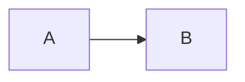

# 复杂测试文档

## 1. 基本格式

这是一个段落，包含**粗体**、*斜体*和`代码`。

## 2. 列表

- 项目1
- 项目2
  - 子项目

1. 有序项目1
2. 有序项目2

## 3. 代码块

```python
def test():
    return "hello"
```

## 4. 表格

| 列1 | 列2 |
|-----|-----|
| A | B |
| C | D |

## 5. 图表


